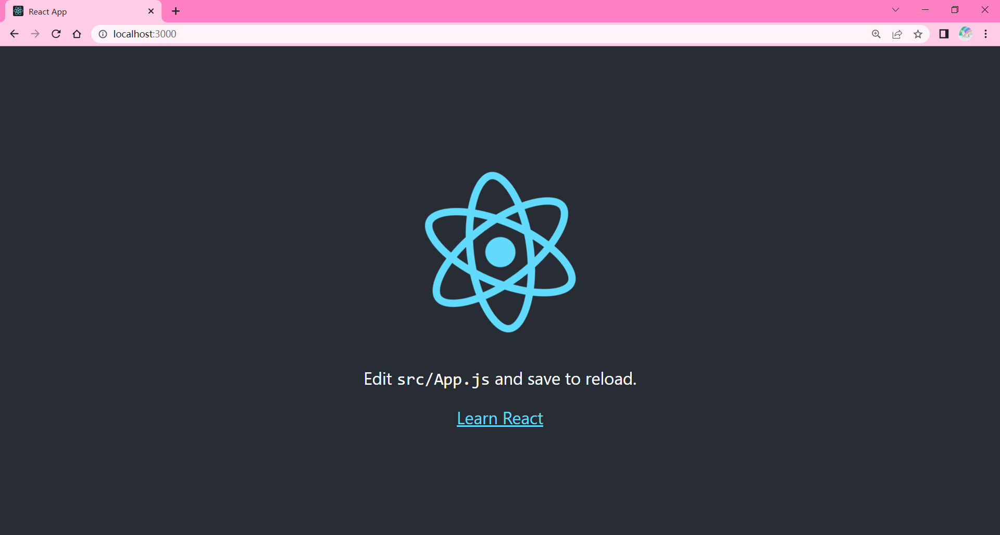
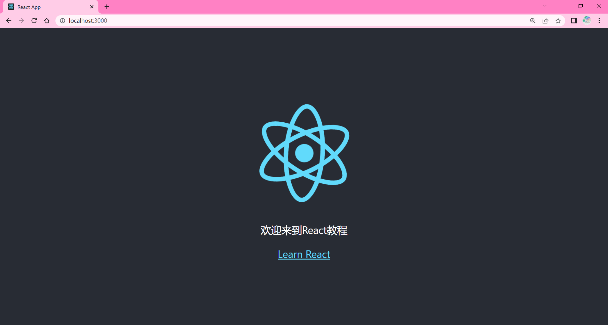
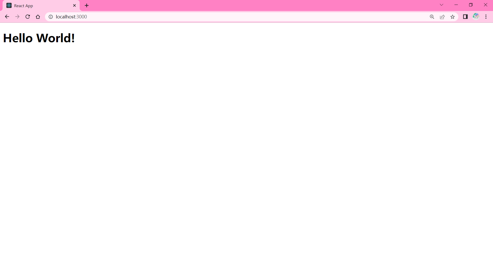

# React 教程

### 1、React

React 是一个用于构建用户界面的 JAVASCRIPT 库。

React 主要用于构建 UI，很多人认为 React 是 MVC 中的 V（视图）。

React 起源于 Facebook 的内部项目，用来架设 Instagram 的网站，并于 2013 年 5 月开源。

React 拥有较高的性能，代码逻辑非常简单，越来越多的人已开始关注和使用它。

#### React 特点

1.声明式设计 −React 采用声明范式，可以轻松描述应用。

2.高效 −React 通过对 DOM 的模拟，最大限度地减少与 DOM 的交互。

3.灵活 −React 可以与已知的库或框架很好地配合。

4.JSX − JSX 是 JavaScript 语法的扩展。React 开发不一定使用 JSX ，但我们建议使用它。

5.组件 − 通过 React 构建组件，使得代码更加容易得到复用，能够很好的应用在大项目的开发中。

6.单向响应的数据流 − React 实现了单向响应的数据流，从而减少了重复代码，这也是它为什么比传统数据绑定更简单。

####　 React 第一个实例

```html
<!DOCTYPE html>
<html>
  <head>
    <meta charset="UTF-8" />
    <title>Hello React!</title>
    <script src="https://cdn.staticfile.org/react/16.4.0/umd/react.development.js"></script>
    <script src="https://cdn.staticfile.org/react-dom/16.4.0/umd/react-dom.development.js"></script>
    <script src="https://cdn.staticfile.org/babel-standalone/6.26.0/babel.min.js"></script>
  </head>
  <body>
    <div id="example"></div>
    <script type="text/babel">
      ReactDOM.render(
        <h1>Hello, world!</h1>,
        document.getElementById("example")
      );
    </script>
  </body>
</html>
```

或者使用 create-react-app 工具（下一章节会介绍）创建的 react 开发环境：

```javascript
import React from "react";
import ReactDOM from "react-dom";

function Hello(props) {
  return <h1>Hello World!</h1>;
}

ReactDOM.render(<Hello />, document.getElementById("root"));
```

这时候浏览器打开 http://localhost:3000/ 就会输出：

```
Hello World!
```

### 2、React 安装

React 可以直接下载使用，下载包中也提供了很多学习的实例。
本教程使用了 React 的版本为 16.4.0，你可以在官网 https://reactjs.org/ 下载最新版。

你也可以直接使用 Staticfile CDN 的 React CDN 库，地址如下：

```javascript
<script src="https://cdn.staticfile.org/react/16.4.0/umd/react.development.js"></script>
<script src="https://cdn.staticfile.org/react-dom/16.4.0/umd/react-dom.development.js"></script>
<!-- 生产环境中不建议使用 -->
<script src="https://cdn.staticfile.org/babel-standalone/6.26.0/babel.min.js"></script>
```

官方提供的 CDN 地址：

```javascript
<script src="https://unpkg.com/react@16/umd/react.development.js"></script>
<script src="https://unpkg.com/react-dom@16/umd/react-dom.development.js"></script>
<!-- 生产环境中不建议使用 -->
<script src="https://unpkg.com/babel-standalone@6.15.0/babel.min.js"></script>
```

注意: 在浏览器中使用 Babel 来编译 JSX 效率是非常低的。

使用实例
以下实例输出了 Hello, world!

```javascript
<!DOCTYPE html>
<html>
<head>
<meta charset="UTF-8" />
<title>Hello React!</title>
<script src="https://cdn.staticfile.org/react/16.4.0/umd/react.development.js"></script>
<script src="https://cdn.staticfile.org/react-dom/16.4.0/umd/react-dom.development.js"></script>
<script src="https://cdn.staticfile.org/babel-standalone/6.26.0/babel.min.js"></script>
</head>
<body>

<div id="example"></div>
<script type="text/babel">
ReactDOM.render(
    <h1>Hello, world!</h1>,
    document.getElementById('example')
);
</script>

</body>
</html>
```

实例解析：

- 实例中我们引入了三个库： react.development.min.js 、react-dom.development.min.js 和 babel.min.js：

- react.min.js - React 的核心库
- react-dom.min.js - 提供与 DOM 相关的功能
- babel.min.js - Babel 可以将 ES6 代码转为 ES5 代码，这样我们就能在目前不支持 ES6 浏览器上执行 React 代码。Babel 内嵌了对 JSX 的支持。通过将 Babel 和 babel-sublime 包（package）一同使用可以让源码的语法渲染上升到一个全新的水平。

```javascript
ReactDOM.render(<h1>Hello, world!</h1>, document.getElementById("example"));
```

> 注意：
> 如果我们需要使用 JSX，则 \<script\> 标签的 type 属性需要设置为 text/babel。

#### 通过 npm 使用 React

国内使用 npm 速度很慢，可以使用淘宝定制的 cnpm (gzip 压缩支持) 命令行工具代替默认的 npm

```
npm install -g cnpm --registry=https://registry.npmmirror.com
npm config set registry https://registry.npmmirror.com
```

##### 使用 create-react-app 快速构建 React 开发环境

create-react-app 是来自于 Facebook，通过该命令我们无需配置就能快速构建 React 开发环境。

create-react-app 自动创建的项目是基于 Webpack + ES6 。

执行以下命令创建项目：

```
cnpm install -g create-react-app
create-react-app my-app
cd my-app/
npm start
```

在浏览器中打开 http://localhost:3000/ ，结果如下图所示：

项目的目录结构如下：

```
my-app
├─ .gitignore
├─ package-lock.json
├─ package.json
├─ public
│  ├─ favicon.ico
│  ├─ index.html
│  ├─ logo192.png
│  ├─ logo512.png
│  ├─ manifest.json
│  └─ robots.txt
├─ README.md
└─ src
   ├─ App.css
   ├─ App.js
   ├─ App.test.js
   ├─ index.css
   ├─ index.js
   ├─ logo.svg
   ├─ reportWebVitals.js
   └─ setupTests.js
```

manifest.json 指定了开始页面 index.html，一切的开始都从这里开始，所以这个是代码执行的源头。

尝试修改 src/App.js 文件代码：
src/App.js

```JavaScript
import logo from './logo.svg';
import './App.css';

function App() {
  return (
    <div className="App">
      <header className="App-header">
        
        <p>
          欢迎来到React教程
        </p>
        <a
          className="App-link"
          href="https://reactjs.org"
          target="_blank"
          rel="noopener noreferrer"
        >
          Learn React
        </a>
      </header>
    </div>
  );
}

export default App;
```

修改后，打开 http://localhost:3000/ （一般自动刷新），输出结果如下：

src/index.js 是一个入口文件，我们可以尝试直接修改 src/index.js 文件代码：

```JavaScript
import React from 'react';
import ReactDOM from 'react-dom/client';
// import './index.css';
// import App from './App';
import reportWebVitals from './reportWebVitals';
function Hello(props) {
  return <h1>Hello World!</h1>;
}
const root = ReactDOM.createRoot(document.getElementById('root'));
root.render(
  <React.StrictMode>
    <Hello />
  </React.StrictMode>
);
```

这时候浏览器打开 http://localhost:3000/ 就会输出：


### 3、React 元素渲染

元素是构成 React 应用的最小单位，它用于描述屏幕上输出的内容。

```JavaScript
const element = <h1>Hello, world!</h1>;
```

与浏览器的 DOM 元素不同，React 当中的元素事实上是普通的对象，React DOM 可以确保 浏览器 DOM 的数据内容与 React 元素保持一致。

##### 将元素渲染到 DOM 中

首先我们在一个 HTML 页面中添加一个 `id="example"` 的 `<div>`:

```html
<div id="example"></div>
```

在此 div 中的所有内容都将由 React DOM 来管理，所以我们将其称为 "根" DOM 节点。

我们用 React 开发应用时一般只会定义一个根节点。但如果你是在一个已有的项目当中引入 React 的话，你可能会需要在不同的部分单独定义 React 根节点。

要将 React 元素渲染到根 DOM 节点中，我们通过把它们都传递给 ReactDOM.render() 的方法来将其渲染到页面上：

```JavaScript
const element = <h1>Hello, world!</h1>;
ReactDOM.render(
    element,
    document.getElementById('example')
);
```

##### 更新元素渲染

React 元素都是不可变的。当元素被创建之后，你是无法改变其内容或属性的。

目前更新界面的唯一办法是创建一个新的元素，然后将它传入 ReactDOM.render() 方法：

来看一下这个计时器的例子:

```JavaScript
function tick() {
  const element = (
    <div>
      <h1>Hello, world!</h1>
      <h2>现在是 {new Date().toLocaleTimeString()}.</h2>
    </div>
  );
  ReactDOM.render(
    element,
    document.getElementById('example')
  );
}

setInterval(tick, 1000);
```

以上实例通过 setInterval() 方法，每秒钟调用一次 ReactDOM.render()。

我们可以将要展示的部分封装起来，以下实例用一个函数来表示：

```JavaScript
import React from 'react';
import ReactDOM from 'react-dom/client';
import reportWebVitals from './reportWebVitals';


function Clock(props) {
  return (
    <div>
      <h1>Hello, world!</h1>
      <h2>现在是 {props.date.toLocaleTimeString()}.</h2>
    </div>
  );
}
const root = ReactDOM.createRoot(document.getElementById('root'));
function tick() {
  root.render(
    <React.StrictMode>
      <Clock date={new Date()} />
    </React.StrictMode>
  );
}

setInterval(tick, 1000);
```

除了函数外我们还可以创建一个 React.Component 的 ES6 类，该类封装了要展示的元素，需要注意的是在 render() 方法中，需要使用 this.props 替换 props：

```JavaScript
import React from 'react';
import ReactDOM from 'react-dom/client';
import reportWebVitals from './reportWebVitals';

class Clock extends React.Component {
  render() {
    return (
      <div>
        <h1>Hello, world!</h1>
        <h2>现在是 {this.props.date.toLocaleTimeString()}.</h2>
      </div>
    );
  }
}
const root = ReactDOM.createRoot(document.getElementById('root'));
function tick() {
  root.render(
    <React.StrictMode>
      <Clock date={new Date()} />
    </React.StrictMode>
  );
}


setInterval(tick, 1000);
```

> _React 只会更新必要的部分_
> 值得注意的是 React DOM 首先会比较元素内容先后的不同，而在渲染过程中只会更新改变了的部分。

### 3、React JSX

React 使用 JSX 来替代常规的 JavaScript。

JSX 是一个看起来很像 XML 的 JavaScript 语法扩展。

我们不需要一定使用 JSX，但它有以下优点：

- JSX 执行更快，因为它在编译为 JavaScript 代码后进行了优化。
- 它是类型安全的，在编译过程中就能发现错误。
- 使用 JSX 编写模板更加简单快速。
  我们先看下以下代码：

```JavaScript
const element = <h1>Hello, world!</h1>;
```

这种看起来可能有些奇怪的标签语法既不是字符串也不是 HTML。

它被称为 JSX， 一种 JavaScript 的语法扩展。 我们推荐在 React 中使用 JSX 来描述用户界面。

JSX 是在 JavaScript 内部实现的。

我们知道元素是构成 React 应用的最小单位，JSX 就是用来声明 React 当中的元素。

与浏览器的 DOM 元素不同，React 当中的元素事实上是普通的对象，React DOM 可以确保 浏览器 DOM 的数据内容与 React 元素保持一致。

要将 React 元素渲染到根 DOM 节点中，我们通过把它们都传递给 ReactDOM.render() 的方法来将其渲染到页面上：

```JavaScript
var myDivElement = <div className="foo" />;
ReactDOM.render(myDivElement, document.getElementById('example'));
```

> _注意:_
> 由于 JSX 就是 JavaScript，一些标识符像 class 和 for 不建议作为 XML 属性名。作为替代，React DOM 使用 className 和 htmlFor 来做对应的属性。

##### 使用 JSX

JSX 看起来类似 HTML ，我们可以看下实例:

```JavaScript
ReactDOM.render(
    <h1>Hello, world!</h1>,
    document.getElementById('example')
);
```

我们可以在以上代码中嵌套多个 HTML 标签，需要使用一个 div 元素包裹它，实例中的 p 元素添加了自定义属性 data-myattribute，添加自定义属性需要使用 data- 前缀。

```JavaScript
ReactDOM.render(
    <div>
    <h1>菜鸟教程</h1>
    <h2>欢迎学习 React</h2>
    <p data-myattribute = "somevalue">这是一个很不错的 JavaScript 库!</p>
    </div>
    ,
    document.getElementById('example')
);
```

##### 独立文件

你的 React JSX 代码可以放在一个独立文件上，例如我们创建一个 helloworld_react.js 文件，代码如下：

```JavaScript
ReactDOM.render(
  <h1>Hello, world!</h1>,
  document.getElementById('example')
);
```

然后在 HTML 文件中引入该 JS 文件：

```html
<body>
  <div id="example"></div>
  <script type="text/babel" src="helloworld_react.js"></script>
</body>
```
##### JavaScript 表达式
我们可以在 JSX 中使用 JavaScript 表达式。表达式写在花括号 {} 中。实例如下：
```JavaScript
ReactDOM.render(
    <div>
      <h1>{1+1}</h1>
    </div>
    ,
    document.getElementById('example')
);
```
在 JSX 中不能使用 `if else` 语句，但可以使用 `conditional` (三元运算) 表达式来替代。以下实例中如果变量 i 等于 1 浏览器将输出 true, 如果修改 i 的值，则会输出 false.
```JavaScript
ReactDOM.render(
    <div>
      <h1>{i == 1 ? 'True!' : 'False'}</h1>
    </div>
    ,
    document.getElementById('example')
);
```
##### 样式
React 推荐使用内联样式。我们可以使用 camelCase 语法来设置内联样式. React 会在指定元素数字后自动添加 px 。以下实例演示了为 h1 元素添加 myStyle 内联样式：
```JavaScript
var myStyle = {
    fontSize: 100,
    color: '#FF0000'
};
ReactDOM.render(
    <h1 style = {myStyle}>菜鸟教程</h1>,
    document.getElementById('example')
);
```
##### 注释
```JavaScript
ReactDOM.render(
    <div>
    <h1>菜鸟教程</h1>
    {/*注释...*/}
     </div>,
    document.getElementById('example')
);
```
#### 数组
```JavaScript
var arr = [
  <h1>菜鸟教程</h1>,
  <h2>学的不仅是技术，更是梦想！</h2>,
];
ReactDOM.render(
  <div>{arr}</div>,
  document.getElementById('example')
);
```
### 4、React 组件
使用组件使得我们的应用更容易来管理
封装一个输出 "Hello World！" 的组件，组件名为 HelloMessage：
```JavaScript
function HelloMessage(props) {
    return <h1>Hello World!</h1>;
}
 
const element = <HelloMessage />;
 
ReactDOM.render(
    element,
    document.getElementById('example')
);
```
实例解析：
1、我们可以使用函数定义了一个组件：
```JavaScript
function HelloMessage(props) {
    return <h1>Hello World!</h1>;
}
```
也可以使用 ES6 class 来定义一个组件:
```JavaScript
class Welcome extends React.Component {
  render() {
    return <h1>Hello World!</h1>;
  }
}
```
2、`const element = <HelloMessage />` 为用户自定义的组件
> 注意
> 原生 HTML 元素名以小写字母开头，而自定义的 React 类名以大写字母开头，比如 HelloMessage 不能写成 helloMessage。除此之外还需要注意组件类只能包含一个顶层标签，否则也会报错。      

如果我们需要向组件传递参数，可以使用 this.props 对象
```JavaScript
function HelloMessage(props) {
    return <h1>Hello {props.name}!</h1>;
}
 
const element = <HelloMessage name="Runoob"/>;
 
ReactDOM.render(
    element,
    document.getElementById('example')
);
```
以上实例中 name 属性通过 props.name 来获取
> 注意
> 在添加属性时， class 属性需要写成 className ，for 属性需要写成 htmlFor ，这是因为 class 和 for 是 JavaScript 的保留字。      
##### 复合组件
可以通过创建多个组件来合成一个组件，即把组件的不同功能点进行分离。
```JavaScript
function Name(props) {
    return <h1>公司名称：{props.name}</h1>;
}
function Url(props) {
    return <h1>公司地址：{props.url}</h1>;
}
function Nickname(props) {
    return <h1>公司简称：{props.nickname}</h1>;
}
function App() {
    return (
    <div>
        <Name name="科大讯飞股份有限公司" />
        <Url url="http://www.iflytek.com" />
        <Nickname nickname="科大讯飞" />
    </div>
    );
}
 
ReactDOM.render(
     <App />,
    document.getElementById('example')
);
```
### 5、React State（状态）
React 把组件看成是一个状态机（State Machines）。通过与用户的交互，实现不同状态，然后渲染 UI，让用户界面和数据保持一致。

React 里，只需更新组件的 state，然后根据新的 state 重新渲染用户界面（不要操作 DOM）。