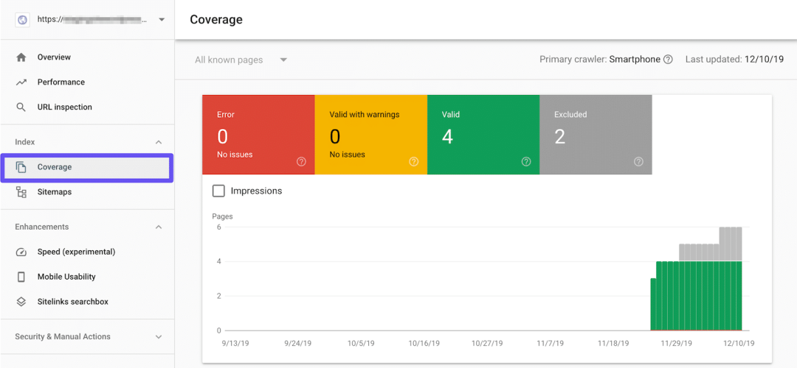
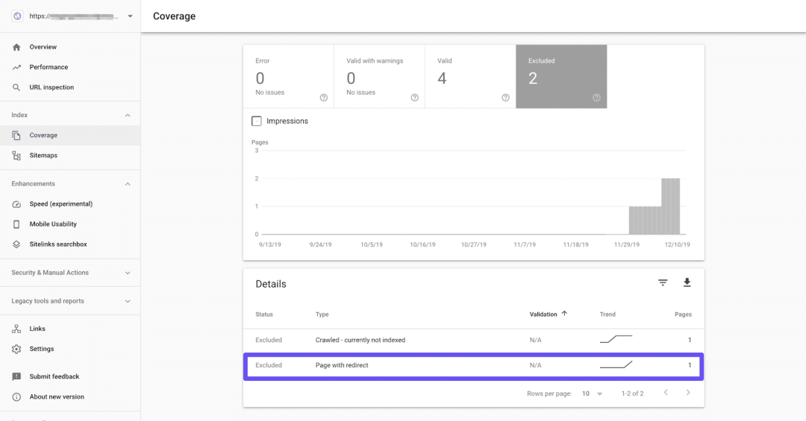

# HTTP状态码完整指南

[mp.weixin.qq.com](http://mp.weixin.qq.com/s?__biz=MzU2MTIyNDUwMA==&mid=2247508509&idx=1&sn=881384593f93a1d0b79d2468c9f34e93&chksm=fc7eec46cb0965503ec44dcf36cb9bc26a223567c62e04034abbf37ec1e173d373243394e61b&mpshare=1&scene=1&srcid=1011X2nBbl84ibgb7svhwbba&sharer_sharetime=1665491792956&sharer_shareid=b8d5da03cbe546fb54510ac993e581cf#rd)CUGGZ 前端充电宝

本文约**4500**字，预计阅读需要**15**分钟。

## 一、HTTP 状态码概述

### 1\. 概念

当我们在浏览器输入URL并按下Enter键时，浏览器就会向站点的服务器发送一个HTTP请求，服务器接收并处理请求，然后将相关资源和HTTP标头一起返回。可以在浏览器的Network中查看 HTTP 的请求状态码：

维基百科中对**HTTP状态码**的解释：

> HTTP状态码（HTTP Status Code）是用以表示网页服务器超文本传输协议响应状态的3位数字代码。它由 RFC 2616 规范定义的，并得到 RFC 2518、RFC 2817、RFC 2295、RFC 2774 与 RFC 4918 等规范扩展。所有状态码被分为五类，状态码的第一个数字代表了响应的五种状态之一。所示的消息短语是典型的，但是可以提供任何可读取的替代方案。除非另有说明，状态码是HTTP/1.1标准（RFC 7231）的一部分。

HTTP 状态代码是从 Web 服务器发送的 3 位代码（如 200 OK 或 404 Not Found），用于让我们和搜索引擎知道请求中是否存在任何错误或服务器尝试处理请求时是否存在任何问题。

### 2\. 分类

应用通常就是客户端向服务器发出请求，服务器做出响应。状态码就是让我们知道 HTTP 请求是成功、失败还是其他。HTTP状态码通常分为五类：

| **类别** | **定义** | **描述** |
| ----- | ----- | ----- |
| 1xx | Informational(信息性状态码) | 接受的请求正在处理 |
| 2xx | Success(成功状态码) | 请求正常处理完毕 |
| 3xx | Redirection(重定向状态码) | 需要进行附加操作来完成请求 |
| 4xx | Client Error (客户端错误状态码) | 服务器无法处理请求 |
| 5xx |Server Error(服务器错误状态码) | 服务器处理请求出错 |

### 3\. 重要性

HTTP 状态代码对于诊断应用问题很重要，例如网络服务器是否无法正常工作且无法提供页面等。快速发现这些问题对于开发人员和搜索引擎提供良好的体验非常重要。那为什么 HTTP 状态代码和错误对搜索引擎优化 (SEO) 很重要呢？

搜索引擎机器人在抓取网站时会看到 HTTP 状态码。在某些情况下，这些会影响网页是否以及如何被编入索引，以及搜索引擎如何看待网站的健康状况。

一般来说，1XX 和 2XX 状态码不会对 SEO 产生太大影响。因为它们表明网站上是正常运行的，并使搜索引擎机器人能够继续执行操作。但是，它们并不会提高网站的排名。在大多数情况下，对 SEO 重要的是更高级别的代码。4XX 和 5XX 响应会阻止机器人抓取和索引页面。错误太多也可能表明网站质量不高，可能会降低网站的排名。

3XX 状态码与 SEO 的关系就会复杂很多。要想了解它们的影响，就需要了解永久重定向和临时重定向之间的区别，这里先不解释，后面再详细介绍。总之，对已经迁移的页面使用永久重定向会有更好的SEO。

可以使用 Google Search Console，在覆盖率报告中查看 3XX、4XX 和 5XX 的状态代码：

这个报告中会显示网站中四种类型的页面：

*   返回错误的页面；
    
*   有警告但是有效的页面；
    
*   有效的页面；
    
*   从索引中排除的页面；
    

我们可以在除了有效页面之外的三类中找到3XX、4XX、5XX 的HTTO状态码的页面，具体的话取决于状态码类型，比如301重定向可能会出现在最后一种中。

4XX 和 5XX 状态码可能会出现在Error下。

## 二、HTTP 状态码列表

### 1\. 1xx Informational

1XX的状态码是在HTTP/1.1 中引入的，它们是信息性的状态码，是临时的，表示请求已被接受，需要继续处理。这些状态码并没有提供太多有用的信息，我们可能永远看不到1XX相关的状态码。

#### （1）100 Continue

服务器已收到浏览器的请求标头，并且现在已准备好发送请求正文。这使得请求过程更加高效，因为它可以防止浏览器发送正文请求，即使标头已被拒绝。

#### （2）101 Switching Protocols

服务器已经接受了客户端的请求，并将通过`Upgrade`消息头通知客户端采用不同的协议来完成这个请求。在发送完这个响应最后的空行后，服务器将会切换到在Upgrade消息头中定义的协议。

#### （3）102 Processing

服务器已经收到并正在处理请求，目前还没有响应。这样可以防止客户端超时，并假设请求丢失。

#### （4）103 Early hints

在服务器响应的HTTP消息之前返回一些响应头。该状态码用于允许用户代理预加载资源，同时服务器准备响应。

### 2\. 2xx Success

2xx 状态码表示客户端的请求被成功接收、理解和接受。

#### （1）200 OK

表示客户端发来的请求被服务器端正常处理了。从 SEO 的角度来看，200 OK 状态码是功能页面的完美状态码，所有链接页面都在正常工作。200 表示搜索引擎爬虫可以成功爬取该页面并将其放入其搜索引擎中。

#### （2）201 Created

服务器完成了浏览器的请求，因此创建了一个或多个新资源。

#### （3）202 Accepted

服务器已接受浏览器的请求，但仍在处理中。该请求最终可能会也可能不会进行响应。

#### （4）203 Non-authoritative Information

使用代理时可能会出现此状态代码。这意味着代理服务器从源服务器收到了 200 状态代码，但在将响应传递给浏览器之前已对其进行了修改。

#### （5）204 No Content

该状态码表示客户端发送的请求已经在服务器端正常处理了，但是没有返回的内容，响应报文中不包含实体的主体部分。一般在只需要从客户端往服务器端发送信息，而服务器端不需要往客户端发送内容时使用。

#### （6）205 Reset Content

服务器端成功处理了请求，且没有返回任何内容。但是与204响应不同，返回此状态码的响应要求请求者重置文档视图。该响应主要是被用于接受用户输入后，立即重置表单，以便用户能够轻松地开始另一次输入。

#### （7）206 Partial Content

该状态码表示客户端进行了范围请求，而服务器端执行了这部分的 GET 请求。响应报文中包含由 `Content-Range` 指定范围的实体内容。

#### （8）226 IM Used

服务器已成功处理浏览器的 GET 方法，以检索已缓存资源的更新版本。通常，当请求的资源有一个或多个轻微修改时返回响应。

### 3\. 3xx Redirection

3XX 响应结果表明浏览器需要执行某些特殊的处理以正确处理请求。

#### （1）300 Multiple Choices

有时，服务器可能会响应多种可能的资源来满足浏览器的请求。300 状态码意味着浏览器现在需要在它们之间进行选择。当有多个可用的文件类型扩展名时，可能会发生这种情况。

#### （2）301 Moved Permanently

**永久重定向。**已为目标资源分配了一个新的永久 URI。新的 URI 会在 HTTP 响应头中的 Location 首部字段指定。若用户已经把原来的URI保存为书签，此时会按照 Location 中新的URI重新保存该书签。同时，搜索引擎在抓取新内容的同时也将旧的网址替换为重定向之后的网址。

#### （3）302 Found

**临时重定向。**请求的资源被分配到了新的 URI，希望用户（本次）能使用新的 URI 访问资源。和 301 Moved Permanently 状态码相似，但是 302 代表的资源不是被永久重定向，只是临时性质的。也就是说已移动的资源对应的 URI 将来还有可能发生改变。

若用户把 URI 保存成书签，但不会像 301 状态码出现时那样去更新书签，而是仍旧保留返回 302 状态码的页面对应的 URI。同时，搜索引擎会抓取新的内容而保留旧的网址。因为服务器返回302代码，搜索引擎认为新的网址只是暂时的。

**使用场景：**

*   未登陆的用户访问用户中心重定向到登录页面。
    
*   访问404页面重新定向到首页。
    

#### （4）303 See Other

由于请求对应的资源存在着另一个 URI，应使用 GET 方法定向获取请求的资源。

303 状态码和 302 Found 状态码有着相似的功能，但是 303 状态码明确表示客户端应当采用 GET 方法获取资源。303 状态码通常作为 PUT 或 POST 操作的返回结果，它表示重定向链接指向的不是新上传的资源，而是另外一个页面，比如消息确认页面或上传进度页面。而请求重定向页面的方法要总是使用 GET。

注意：

> *   当 301、302、303 响应状态码返回时，几乎所有的浏览器都会把 POST 改成GET，并删除请求报文内的主体，之后请求会再次自动发送。
>     
> *   301、302 标准是禁止将 POST 方法变成 GET方法的，但实际大家都会这么做。
>     

#### （5）304 Not Modified

浏览器缓存相关。该状态码表示客户端发送附带条件的请求时，服务器端允许请求访问资源，但未满足条件的情况。304 状态码返回时，不包含任何响应的主体部分。304 虽然被划分在 3XX 类别中，但是和重定向没有关系。

带条件的请求（Http 条件请求）：使用 Get方法 请求，请求报文中包含（`if-match`、`if-none-match`、`if-modified-since`、`if-unmodified-since`、`if-range`）中任意首部。

状态码304并不是一种错误，而是告诉客户端有缓存，直接使用缓存中的数据。返回页面的只有头部信息，是没有内容部分的，这样在一定程度上提高了网页的性能。

#### （6）305 Use Proxy

服务器需要代理才能返回请求的资源。此响应代码当前未使用，因为当前大多数浏览器由于安全问题不支持它。

#### （7）307 Temporary Redirect

**临时重定向**。该状态码与 302 Found 有着相同含义，尽管 302 标准禁止 POST 变成 GET，但是实际使用时还是用了。307 会遵守浏览器标准，**不会从 POST 变成 GET**。但是对于处理请求的行为时，不同浏览器还是会出现不同的情况。规范要求浏览器继续向 Location 的地址 POST 内容。规范要求浏览器继续向 Location 的地址 POST 内容。

#### （8）308 Permanent Redirect

永久重定向，当前及未来的请求重定向到了新的 URL。

### 4\. 4xx Client errors

#### （1）400 Bad Request

请求报文中存在语法错误。当错误发生时，需修改请求的内容后再次发送请求。

#### （2）401 Unauthorized

发送的请求需要有通过 HTTP 认证(BASIC 认证、DIGEST 认证)的认证信息。若之前已进行过一次请求，则表示用户认证失败。返回含有 401 的响应必须包含一个适用于被请求资源的 WWW-Authenticate 首部用以质询(challenge)用户信息。当浏览器初次接收到 401 响应，会弹出认证用的对话窗口。

#### （3）402 Payment Required

为数字支付系统保留的。不过，它并没有被广泛使用。

#### （4）403 Forbidden

客户端请求已被拒绝，因为客户端无权访问内容。与 401 不同，服务器知道客户端的身份，但由于他们无权查看内容，因此服务器拒绝提供正确的响应。

#### （5）404 Not Found

服务器上无法找到请求的资源，但将来可能可用。除此之外，也可以在服务器端拒绝请求且不想说明理由时使用。

#### （6）405 Method Not Allowed

服务器识别到浏览器使用的 HTTP 请求方法，但需要使用不同的方法才能提供所需的资源。服务器应该总是允许客户端使用 GET 和 HEAD 方法进行访问。

客户端可以通过 OPTIONS 方法（预检）来查看服务器允许的访问方法, 如下

`Access-Control-Allow-Methods:GET,HEAD,PUT,PATCH,POST,DELETE-
`

#### （7）406 Not Acceptable

服务器通知客户端没有资源符合浏览器请求的标准。

#### （8）407 Proxy Authentication Required

客户端必须首先通过代理进行身份验证。

#### （9）408 Request Timeout

当服务器在等待来自浏览器的完整请求时超时时会生成此状态码。换句话说，服务器没有收到浏览器发送的完整请求。一种可能的原因就是网络拥塞导致浏览器和服务器之间的数据包丢失。

#### （10）409 Conflict

服务器无法处理浏览器的请求，因为与相关资源存在冲突。这有时是由于多个同时编辑而发生的。

#### （11）410 Gone

请求的资源将来将不再可用。

#### （12）411 Length Required

请求的资源需要客户端指定一定的长度，通过 Content-Length 来定义。

#### （13）412 Precondition Failed

服务器不满足请求头字段中指示的一个或多个先决条件。

#### （14）413 Payload Too Large

服务器拒绝处理请求，因为请求的负载大于服务器能够或愿意处理的。虽然服务器可能会关闭连接以阻止客户端继续请求，但它应该生成一个 Retry-After 头字段以及客户端可以在多长时间后重试。

#### （15）414 Request-URI Too Long

浏览器发出的请求无法被服务器处理，因为客户端将太多数据编码为查询字符串，然后作为 GET 方法发送。

#### （16）415 Unsupported Media Type

请求已被服务器拒绝，因为它不支持请求数据的媒体格式。

#### （17）416 Requested Range Not Satisfiable

请求的 Range 头中指定的范围无法满足。原因可能是给定范围超出了目标 URI 数据的大小。

#### （18）417 Expectation Failed

服务器无法满足请求的请求头的 Expect 字段中指定的要求。

#### （19）421 Misdirected Request

浏览器的请求已被重定向到其他服务器，该服务器无法产生响应。

#### （20）422 Unprocessable Entity

浏览器发出的请求中存在语义错误，服务器无法处理。

#### （21）423 Locked

对所需资源的访问被拒绝，因为它已被锁定。

#### （22）424 Failed Dependency

浏览器发出的请求失败，因为它依赖于另一个请求，而该请求失败了。

#### （23）426 Upgrade Required

当服务器拒绝使用当前协议执行给定的请求时，它可能愿意在客户端升级到不同的协议后这来执行请求。

#### （24）428 Precondition Required

服务器要求在处理请求之前指定条件。

#### （25）429 Too Many Requests

用户在给定的时间内发送了太多请求（速率限制）时，这是由服务器生成的。这有时可能是由于机器人或脚本试图访问站点而造成的。

#### （26）431 Request Header Fields Too Large

服务器无法处理请求，因为标头字段太大。这可能是单个标头字段或所有标头字段存在问题。

#### （27）451 Unavailable For Legal Reasons

服务器的运营商收到了禁止访问请求的资源的要求。

#### （28）499 Client closed request

当 nginx 正在处理请求时，客户端关闭了连接，nginx 就会返回此状态码。

### 5\. 5xx Server Error

5XX 的响应结果表明服务器本身发生错误。

#### （1）500 Internal Server Error

服务器端在执行请求时发生了错误。也有可能是应用存在 bug 或某些临时的故障。

#### （2）501 Not Implemented

请求无法处理，因为服务器不支持。

#### （3）502 Bad Gateway

该扮演网关或代理角色的服务器从上游服务器中接收到的响应是无效的。注意，502 错误通常不是客户端能够修复的，而是需要由途经的服务器或者代理服务器对其进行修复

#### （4）503 Service Unavailable

服务器暂时处于超负载或正在进行停机维护，现在无法处理请求。

**使用场景：**

*   服务器停机维护时，主动用503响应请求；
    
*   nginx 设置限速，超过限速，会返回503。
    

#### （5）504 Gateway Timeout

网关或者代理的服务器无法在规定的时间内获得想要的响应。它是HTTP 1.1中新加入的。

**使用场景：**

*   代码执行时间超时；
    
*   代码发生了死循环。
    

#### （6）505 HTTP Version Not Supported

请求中使用的 HTTP 版本不受服务器支持。

#### （7）506 Variant Also Negotiates

服务器内部配置错误。

#### （8）507 Insufficient Storage

服务器无法存储完成请求所必须的内容。

#### （9）508 Loop Detected

服务器在处理请求时检测到无限循环。

#### （10）510 Not Extended

服务器需要进一步扩展才能满足请求。

#### （11）511 Network Authentication Required

客户端需要进行身份验证才能获得访问权限。
