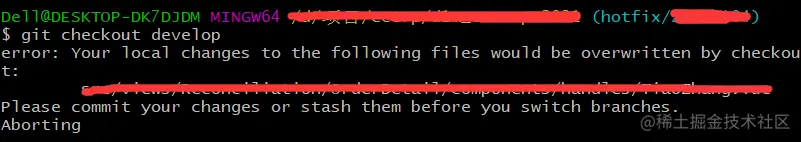
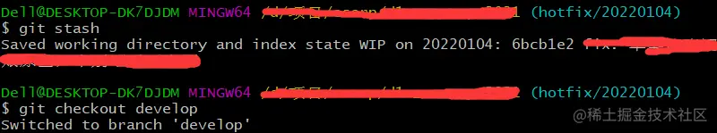
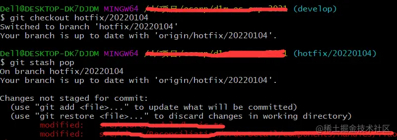

# git如何不提交当前分支的修改，并且切换到其他分支
https://juejin.cn/post/7049242305844215844

> 场景：你正在一个feature分支愉快的开发一个新功能，做到一半产品突然跑过来让你修改一个线上bug

这应该是比较常见的场景，你不想把做到一半的东西提交到分支上，如果直接切换分支，就会提示让你先commit再切换分支



- 此时可以考虑将未提交的修改进行`暂存`，然后再切换到其他分支上

```
git stash
```



需要注意的是这个命令只会将已提交过的文件（tracked）进行暂存，如果有新增的文件是不会暂存的，可以使用

```
git stash --include-untracked
```

- 在其他分支上修改完以后再切回之前的feature分支，把暂存的修改拿出来

```
git stash pop
```



- `pop`后可以跟上具体的哪一个`stash`，查看stash列表

```
git stash list
```

- `pop`会将`stash`应用到当前分支，并且在堆栈中删除，如果想将stash应用到当前分支并保留

```
git stash apply
```

- 其他常用命令

```
git stash show // 查看最新的stash和当前的差异
git stash drop {名称} // 最列表中删除某个指定stash
git stash clear // 清除所有stash
git stash branch // 从最新stash创建分支
```

作者：味精王
链接：https://juejin.cn/post/7049242305844215844
来源：稀土掘金
著作权归作者所有。商业转载请联系作者获得授权，非商业转载请注明出处。