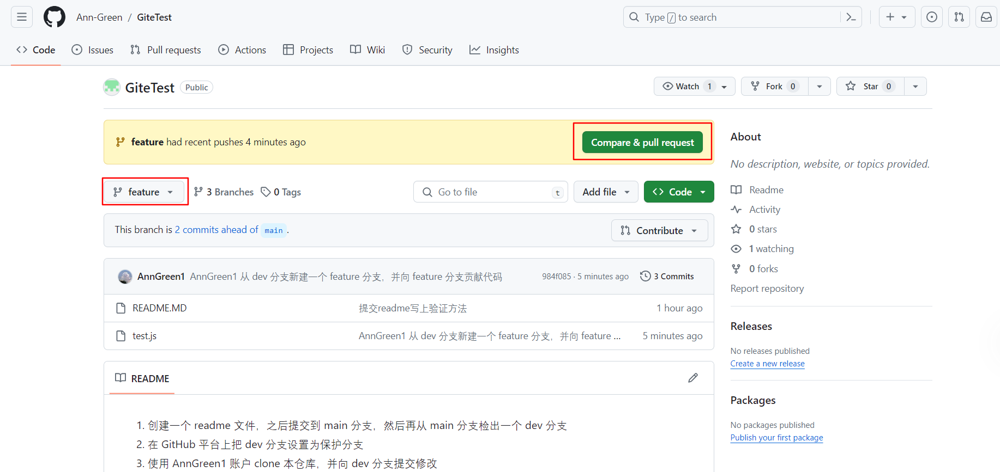
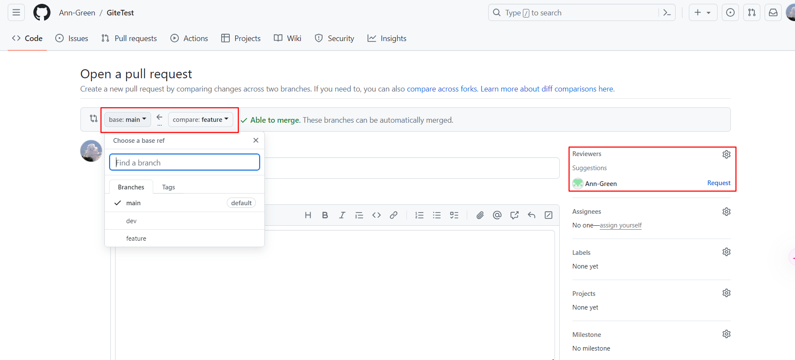
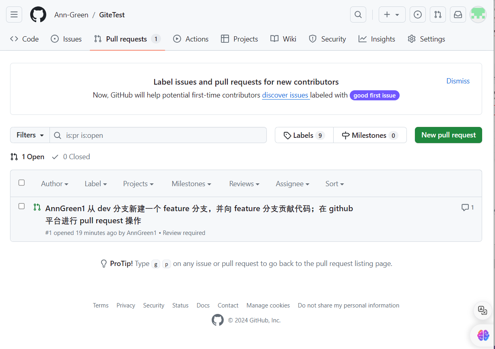
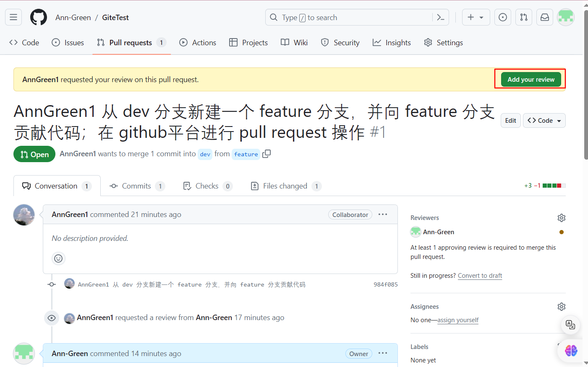
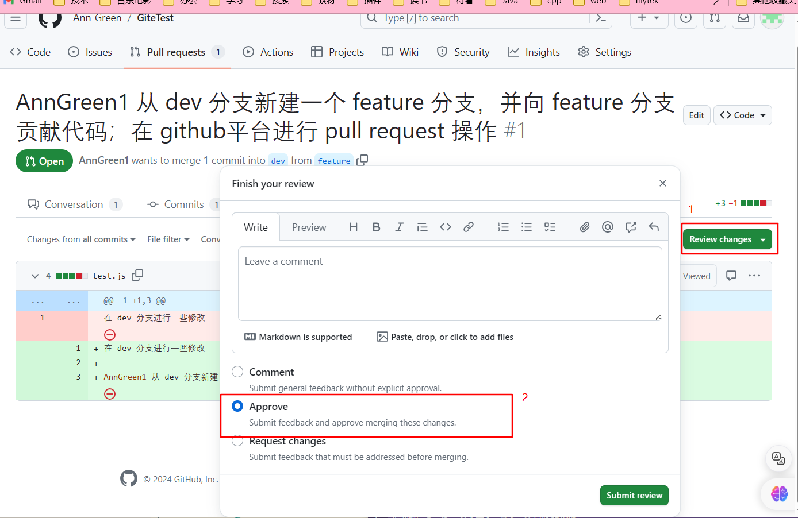
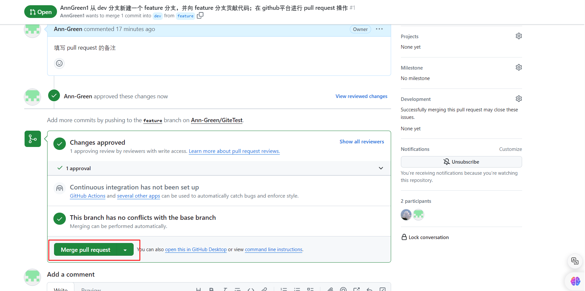
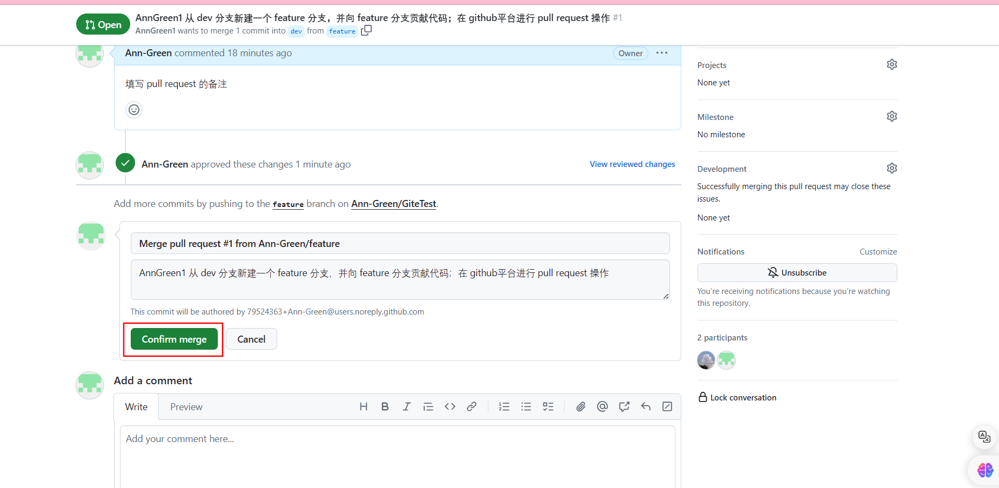
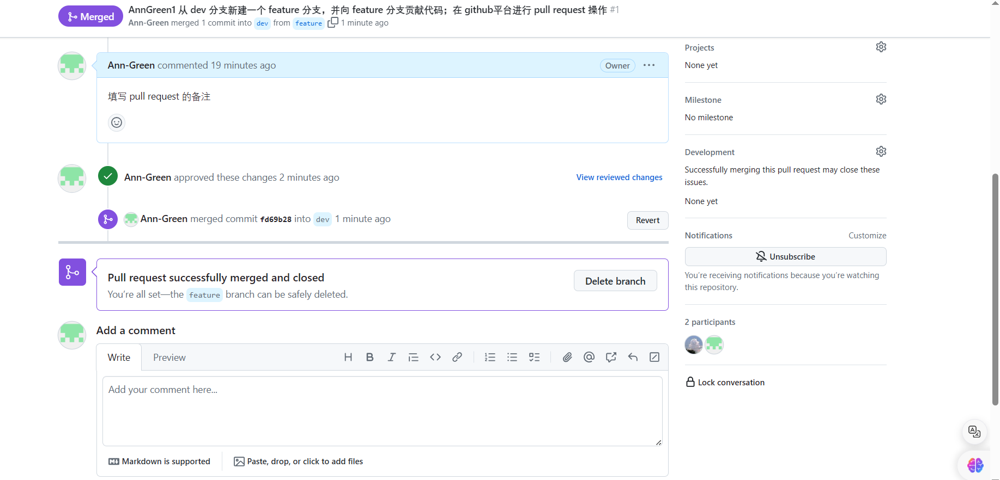

### 受保护分支是什么？默认分支是什么？
受保护分支（Protected Branch）是在Git仓库中设置了额外权限和限制的分支。受保护分支通常具有以下特点：

1. **需要权限才能推送代码**：在受保护分支上，只有具有相应权限的团队成员才能将代码推送到该分支，这可以防止未经授权的修改。

2. **需要权限才能合并代码**：除了推送代码外，受保护分支上的代码合并也可能需要特定权限。这可以确保只有经过审查和测试的代码才能合并到受保护分支中。

3. **需要通过审查才能合并**：有些受保护分支设置了代码审查（Code Review）的要求，即必须经过其他团队成员的审查才能合并代码。

受保护分支并不意味着不能直接合并代码，而是通过设置权限和限制来确保代码的质量和安全性。一般来说，受保护分支上的代码合并可能需要经过一些额外的步骤，比如审查、测试或权限验证。

因此，不能直接合并代码并不是受保护分支的唯一标志，受保护分支还包括了对代码推送和合并的权限控制。


默认分支（Default Branch）是指在一个Git仓库中默认显示的主要分支。在过去，很多Git仓库的默认分支名称是`master`，但随着对术语的审查和改进，一些代码托管平台（比如GitHub、GitLab等）已经开始将默认分支的名称更改为`main`。

默认分支的名称可以根据个人或团队的偏好进行设置，通常是在创建新仓库时选择的。默认分支在Git仓库中具有特殊的意义，比如在没有指定分支名称的情况下执行`git pull`或`git push`时，默认会操作默认分支。

你可以随时更改默认分支的名称，但需要注意一些潜在影响，比如已有的CI/CD流程、脚本或其他自动化工具可能会依赖于默认分支的名称。如果要更改默认分支的名称，建议提前通知团队成员，并确保相应的调整和测试。

要更改默认分支的名称，可以通过以下步骤：

1. **在本地仓库更改默认分支名称**：
   ```
   git branch -m <new-branch-name>
   git push -u origin <new-branch-name>
   ```

2. **在远程仓库更改默认分支名称**：在代码托管平台上找到仓库设置中的默认分支选项，并选择新的默认分支名称。

请谨慎操作，确保在更改默认分支名称之前备份重要数据，并通知团队成员。

### 受保护分支和其他分支有什么区别？
受保护分支和普通分支之间有几个关键区别：

1. **权限控制**：
   - **受保护分支**：受保护分支设置了额外的权限和限制，只有具有相应权限的团队成员才能推送代码或合并代码到该分支。
   - **普通分支**：普通分支通常没有额外的权限控制，任何有权限的团队成员都可以在普通分支上推送代码或合并代码。

2. **审查要求**：
   - **受保护分支**：有些受保护分支设置了代码审查的要求，即必须经过其他团队成员的审查才能将代码合并到该分支。
   - **普通分支**：普通分支上的代码合并可能不需要经过审查，可以直接由团队成员自行合并。

3. **安全性和稳定性**：
   - **受保护分支**：受保护分支通常用于存放稳定和经过审查的代码，以确保代码质量和安全性。
   - **普通分支**：普通分支可能用于开发新功能、实验性的修改或临时性的工作，不一定经过严格的审查和测试。

4. **操作限制**：
   - **受保护分支**：受保护分支可能限制了一些操作，比如强制推送（force push）或历史重写（history rewriting）等操作可能会受到限制。
   - **普通分支**：普通分支上的操作可能更加灵活，团队成员可以自由地进行各种操作。

总的来说，受保护分支主要用于存放稳定和经过审查的代码，具有更严格的权限控制和审查要求；而普通分支则更加灵活，可以用于开发和实验性工作。根据团队的需求和工作流程，可以灵活地选择使用受保护分支或普通分支来管理代码。


### 自己作为所有者的仓库自己仍然可以不受限制向受保护分支提交代码？
**即使你的仓库设置了某个分支为受保护分支，仓库所有者通常仍然拥有足够的权限来提交代码到受保护分支，即使其他团队成员可能被限制。这是因为仓库所有者通常被视为具有最高权限，可以执行对仓库的所有操作，包括提交代码到受保护分支。**

**虽然仓库所有者可以绕过受保护分支的权限限制，但通常情况下，仓库所有者也应该遵守团队的代码审查和流程规定，以确保代码质量和安全性。如果仓库所有者需要提交代码到受保护分支，建议他们也经过相应的代码审查和测试，以确保代码的质量和稳定性。**

**在设置受保护分支时，应该明确团队成员的权限和审查要求，以确保团队的代码管理和合作流畅进行。仓库所有者应该在必要时行使其权限，并以身作则，遵守团队的规定和最佳实践。**

### 实战
1. 创建一个 readme 文件，之后提交到 main 分支，然后再从 main 分支检出一个 dev 分支
2. 在 GitHub 平台上把 dev 分支设置为保护分支
3. 使用 AnnGreen1 账户 clone 本仓库，并向 dev 分支提交修改
提示如下没有提交成功，并且github平台没有看到pr
```
remote: Permission to Ann-Green/GiteTest.git denied to AnnGreen1.
fatal: unable to access 'https://github.com/Ann-Green/GiteTest.git/': The requested URL returned error: 403
```
4. 在 Ann-Green 的 github 平台 GitTest 项目设置中添加贡献者，添加AnnGreen1
5. AnnGreen1 在 dev 分支的基础上新建 feature 分支并提交到仓库，（分支）提交成功，之后把需要修改的陆续提交到该分支
6. Ann-Green 在其git平台查看仓库 feature 分支，点击 `Compare & pull request`








4. 在 Ann-Green 的 github 平台查看是否修改成功
