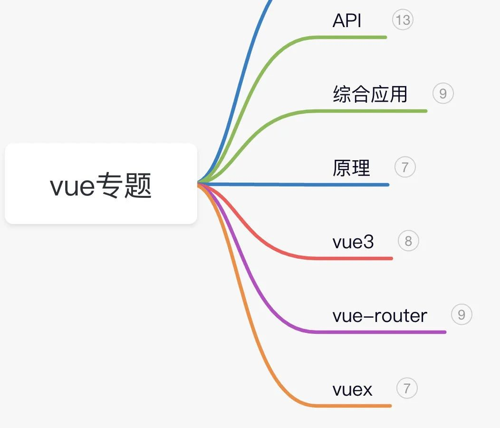
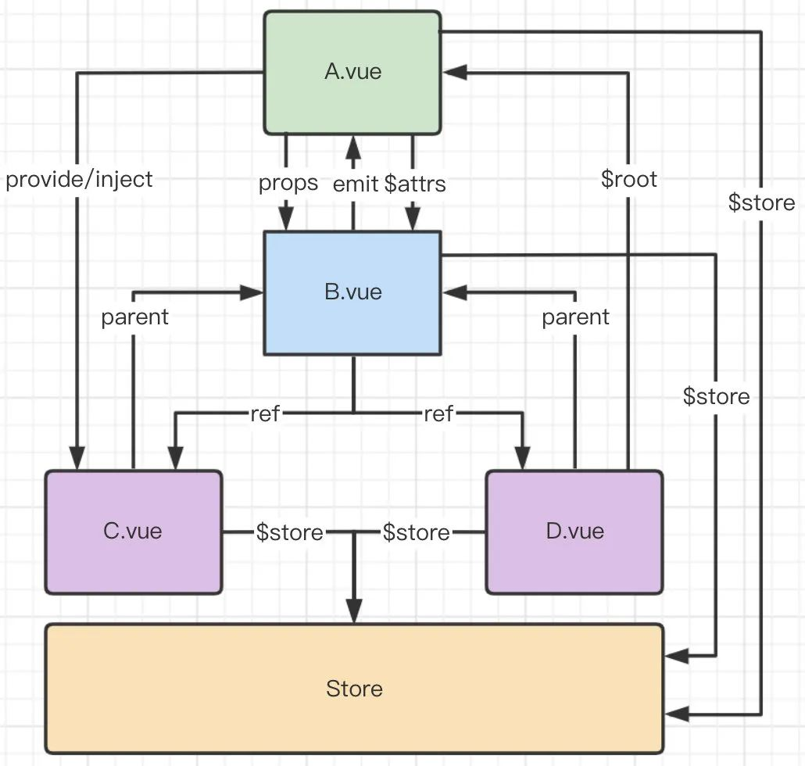
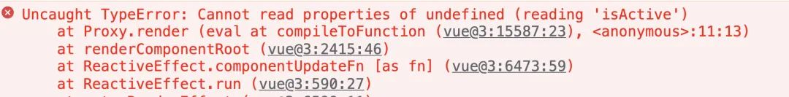
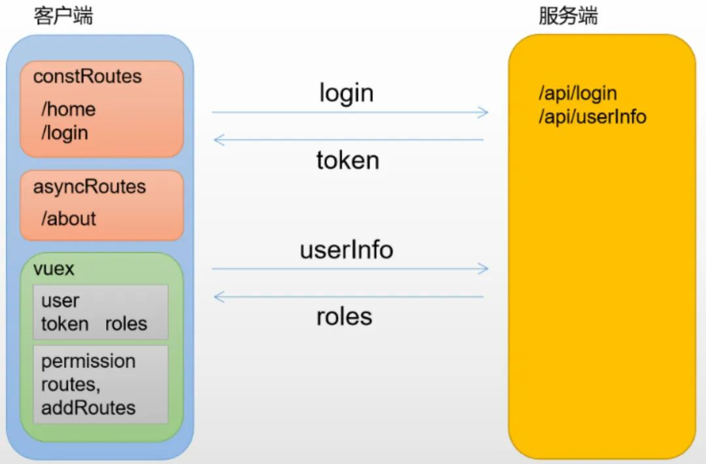
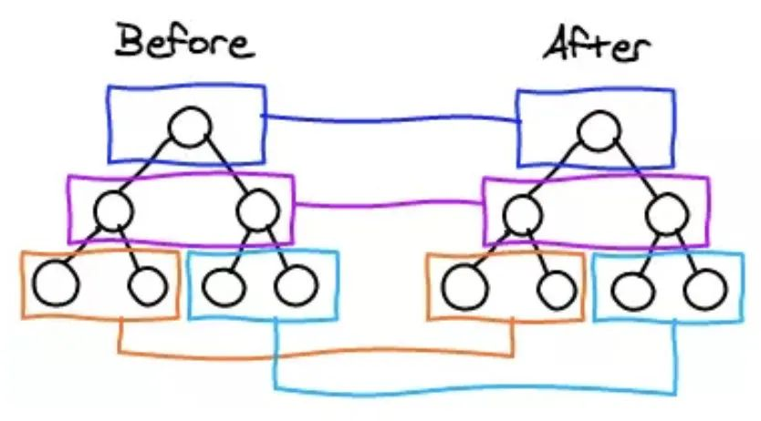
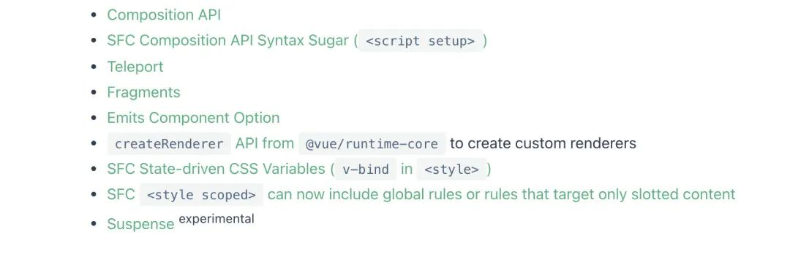
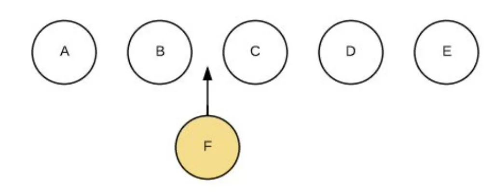
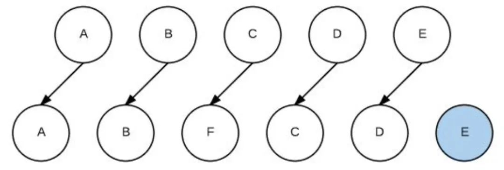
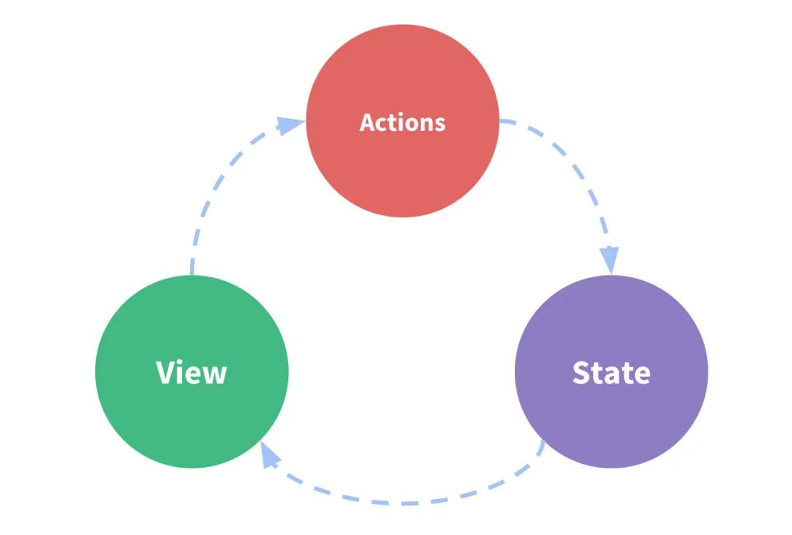

# 历时一个月！50+Vue 经典面试题详解，值得收藏！

[mp.weixin.qq.com](https://mp.weixin.qq.com/s/lwg7aZ_qdZbfebjU_hgB4Q)前端杨村长 若川视野



大家好，我是若川。持续组织了 8 个月[源码共读活动](http://mp.weixin.qq.com/s?__biz=MzA5MjQwMzQyNw==&mid=2650761094&idx=2&sn=0d0e9de8fc6554b3074913697511c9a2&chksm=8866640abf11ed1c0bdf43f4758c3bb9a74c90c48ed76eed46dca1af6e9b63b992def9b3655c&scene=21#wechat_redirect)，感兴趣的可以[点此加我微信 ruochuan12](http://mp.weixin.qq.com/s?__biz=MzA5MjQwMzQyNw==&mid=2650761094&idx=2&sn=0d0e9de8fc6554b3074913697511c9a2&chksm=8866640abf11ed1c0bdf43f4758c3bb9a74c90c48ed76eed46dca1af6e9b63b992def9b3655c&scene=21#wechat_redirect)参与，每周大家一起学习 200 行左右的源码，共同进步。同时极力推荐订阅我写的[《学习源码整体架构系列》](https://mp.weixin.qq.com/mp/appmsgalbum?__biz=MzA5MjQwMzQyNw==&action=getalbum&album_id=1342211915371675650&scene=173&from_msgid=2650759428&from_itemidx=1&count=3&nolastread=1#wechat_redirect)包含 20 余篇源码文章。[历史面试系列](https://mp.weixin.qq.com/mp/appmsgalbum?__biz=MzA5MjQwMzQyNw==&action=getalbum&album_id=1932984266565484545#wechat_redirect)。另外：目前建有`江西|湖南|湖北`籍前端群，可加我微信进群。

---

## 前言

大家好，我是村长，一个爱分享的老前端。前一段时间有很多小伙伴找我做经典 Vue 面试题解析。我整整花了 1 个月时间找题写答案，录视频。本来打算全部写完再来发一篇鸿篇巨制，不过找我要学习材料的太多，只好提前发布。这里是已经写完的前半部分，大家务必点赞、收藏保存一下，我后续还在这一篇更新下半部分，希望大家多多支持村长。

## 相关学习资源

本系列有配套视频教程，思维导图和开源项目，大家学习同时千万不要忘了`三连` + `关注` + `分享`

- 视频教程：【Vue 面试专题】金三银四必备！56 道经典 Vue 面试题详
- 思维导图：Vue 面试专题
- 配套代码：vue-interview

---

## 01-Vue 组件之间通信方式有哪些

vue 是组件化开发框架，所以对于 vue 应用来说组件间的数据通信非常重要。此题主要考查大家 vue 基本功，对于 vue 基础 api 运用熟练度。另外一些边界知识如 provide/inject/$attrs 则提现了面试者的知识广度。

---

组件传参的各种方式

---

### 思路分析：

1.  总述知道的所有方式
2.  按组件关系阐述使用场景

---

### 回答范例：

1.  组件通信常用方式有以下 8 种：

- props
- \$emit/$on
- ~~\$children~~/\$parent
- \$attrs/~~\$listeners~~
- ref
- $root
- eventbus
- vuex

> 注意 vue3 中废弃的几个 API
>
> https://v3-migration.vuejs.org/breaking-changes/children.html
>
> https://v3-migration.vuejs.org/breaking-changes/listeners-removed.html
>
> https://v3-migration.vuejs.org/breaking-changes/events-api.html#overview

---

2.  根据组件之间关系讨论组件通信最为清晰有效

- 父子组件

- `props`/`$emit`/`$parent`/`ref`/`$attrs`

- 兄弟组件

- `$parent`/`$root`/`eventbus`/`vuex`

- 跨层级关系

- `eventbus`/`vuex`/`provide`+`inject`

---

## 02-v-if 和 v-for 哪个优先级更高？

### 分析：

此题考查常识，文档中曾有详细说明 v2|v3；也是一个很好的实践题目，项目中经常会遇到，能够看出面试者 api 熟悉程度和应用能力。

---

### 思路分析：

1.  先给出结论
2.  为什么是这样的，说出细节
3.  哪些场景可能导致我们这样做，该怎么处理
4.  总结，拔高

---

### 回答范例：

1.  实践中**不应该把 v-for 和 v-if 放一起**
2.  在**vue2 中**，**v-for 的优先级是高于 v-if**，把它们放在一起，输出的渲染函数中可以看出会先执行循环再判断条件，哪怕我们只渲染列表中一小部分元素，也得在每次重渲染的时候遍历整个列表，这会比较浪费；另外需要注意的是在**vue3 中则完全相反，v-if 的优先级高于 v-for**，所以 v-if 执行时，它调用的变量还不存在，就会导致异常
3.  通常有两种情况下导致我们这样做：

- 为了**过滤列表中的项目** (比如 `v-for="user in users" v-if="user.isActive"`)。此时定义一个计算属性 (比如 `activeUsers`)，让其返回过滤后的列表即可（比如`users.filter(u=>u.isActive)`）。
- 为了**避免渲染本应该被隐藏的列表** (比如 `v-for="user in users" v-if="shouldShowUsers"`)。此时把 `v-if` 移动至容器元素上 (比如 `ul`、`ol`)或者外面包一层`template`即可。

5.  文档中明确指出**永远不要把 `v-if` 和 `v-for` 同时用在同一个元素上**，显然这是一个重要的注意事项。
6.  源码里面关于代码生成的部分，能够清晰的看到是先处理 v-if 还是 v-for，顺序上 vue2 和 vue3 正好相反，因此产生了一些症状的不同，但是不管怎样都是不能把它们写在一起的。

---

### 知其所以然：

做个测试，test.html 两者同级时，渲染函数如下：

```js
ƒ anonymous(
) {
with(this){return _c('div',{attrs:{"id":"app"}},_l((items),function(item){return (item.isActive)?_c('div',{key:item.id},[_v("\n      "+_s(item.name)+"\n    ")]):_e()}),0)}
}
```

---

做个测试，test-v3.html



---

源码中找答案

v2：https://github1s.com/vuejs/vue/blob/HEAD/src/compiler/codegen/index.js#L65-L66

v3：https://github1s.com/vuejs/core/blob/HEAD/packages/compiler-core/src/codegen.ts#L586-L587

---

## 03-简述 Vue 的生命周期以及每个阶段做的事

必问题目，考查 vue 基础知识。

### 思路

1.  给出概念
2.  列举生命周期各阶段
3.  阐述整体流程
4.  结合实践
5.  扩展：vue3 变化

---

### 回答范例

1.每个 Vue 组件实例被创建后都会经过一系列初始化步骤，比如，它需要数据观测，模板编译，挂载实例到 dom 上，以及数据变化时更新 dom。这个过程中会运行叫做生命周期钩子的函数，以便用户在特定阶段有机会添加他们自己的代码。

2.Vue 生命周期总共可以分为 8 个阶段：**创建前后, 载入前后, 更新前后, 销毁前后**，以及一些特殊场景的生命周期。vue3 中新增了三个用于调试和服务端渲染场景。

---

| 生命周期 v2   | 生命周期 v3       | 描述                       |
| ------------- | ----------------- | -------------------------- |
| beforeCreate  | beforeCreate      | 组件实例被创建之初         |
| created       | created           | 组件实例已经完全创建       |
| beforeMount   | beforeMount       | 组件挂载之前               |
| mounted       | mounted           | 组件挂载到实例上去之后     |
| beforeUpdate  | beforeUpdate      | 组件数据发生变化，更新之前 |
| updated       | updated           | 数据数据更新之后           |
| beforeDestroy | **beforeUnmount** | 组件实例销毁之前           |
| destroyed     | **unmounted**     | 组件实例销毁之后           |

---

| 生命周期 v2   | 生命周期 v3         | 描述                                     |
| ------------- | ------------------- | ---------------------------------------- |
| activated     | activated           | keep-alive 缓存的组件激活时              |
| deactivated   | deactivated         | keep-alive 缓存的组件停用时调用          |
| errorCaptured | errorCaptured       | 捕获一个来自子孙组件的错误时被调用       |
| \-            | **renderTracked**   | 调试钩子，响应式依赖被收集时调用         |
| \-            | **renderTriggered** | 调试钩子，响应式依赖被触发时调用         |
| \-            | **serverPrefetch**  | ssr only，组件实例在服务器上被渲染前调用 |

---

3.`Vue`生命周期流程图：


---

4.结合实践：

**beforeCreate**：通常用于插件开发中执行一些初始化任务

**created**：组件初始化完毕，可以访问各种数据，获取接口数据等

**mounted**：dom 已创建，可用于获取访问数据和 dom 元素；访问子组件等。

**beforeUpdate**：此时`view`层还未更新，可用于获取更新前各种状态

**updated**：完成`view`层的更新，更新后，所有状态已是最新

**beforeunmount**：实例被销毁前调用，可用于一些定时器或订阅的取消

**unmounted**：销毁一个实例。可清理它与其它实例的连接，解绑它的全部指令及事件监听器

### 可能的追问

1.  setup 和 created 谁先执行？
2.  setup 中为什么没有 beforeCreate 和 created？

---

### 知其所以然

vue3 中生命周期的派发时刻：

https://github1s.com/vuejs/core/blob/HEAD/packages/runtime-core/src/componentOptions.ts#L554-L555

vue2 中声明周期的派发时刻：

https://github1s.com/vuejs/vue/blob/HEAD/src/core/instance/init.js#L55-L56

---

## 04-能说一说双向绑定使用和原理吗？

### 题目分析：

双向绑定是`vue`的特色之一，开发中必然会用到的知识点，然而此题还问了实现原理，升级为深度考查。

---

### 思路分析：

1.  给出双绑定义
2.  双绑带来的好处
3.  在哪使用双绑
4.  使用方式、使用细节、vue3 变化
5.  原理实现描述

---

### 回答范例：

1.  vue 中双向绑定是一个指令`v-model`，可以绑定一个响应式数据到视图，同时视图中变化能改变该值。
2.  `v-model`是语法糖，默认情况下相当于`:value`和`@input`。使用`v-model`可以减少大量繁琐的事件处理代码，提高开发效率。
3.  通常在表单项上使用`v-model`，还可以在自定义组件上使用，表示某个值的输入和输出控制。
4.  通过`<input v-model="xxx">`的方式将 xxx 的值绑定到表单元素 value 上；对于 checkbox，可以使用`true-value`和 false-value 指定特殊的值，对于 radio 可以使用 value 指定特殊的值；对于 select 可以通过 options 元素的 value 设置特殊的值；还可以结合.lazy,.number,.trim 对 v-mode 的行为做进一步限定；`v-model`用在自定义组件上时又会有很大不同，vue3 中它类似于`sync`修饰符，最终展开的结果是 modelValue 属性和 update:modelValue 事件；vue3 中我们甚至可以用参数形式指定多个不同的绑定，例如 v-model:foo 和 v-model:bar，非常强大！
5.  `v-model`是一个指令，它的神奇魔法实际上是 vue 的编译器完成的。我做过测试，包含`v-model`的模板，转换为渲染函数之后，实际上还是是 value 属性的绑定以及 input 事件监听，事件回调函数中会做相应变量更新操作。编译器根据表单元素的不同会展开不同的 DOM 属性和事件对，比如 text 类型的 input 和 textarea 会展开为 value 和 input 事件；checkbox 和 radio 类型的 input 会展开为 checked 和 change 事件；select 用 value 作为属性，用 change 作为事件。

---

### 可能的追问：

1.  `v-model`和`sync`修饰符有什么区别
2.  自定义组件使用`v-model`如果想要改变事件名或者属性名应该怎么做

---

### 知其所以然：

测试代码，test.html

观察输出的渲染函数：

```js
// <input type="text" v-model="foo">
_c("input", {
  directives: [
    { name: "model", rawName: "v-model", value: foo, expression: "foo" },
  ],
  attrs: { type: "text" },
  domProps: { value: foo },
  on: {
    input: function ($event) {
      if ($event.target.composing) return;
      foo = $event.target.value;
    },
  },
});
```

---

```js
// <input type="checkbox" v-model="bar">
_c("input", {
  directives: [
    { name: "model", rawName: "v-model", value: bar, expression: "bar" },
  ],
  attrs: { type: "checkbox" },
  domProps: {
    checked: Array.isArray(bar) ? _i(bar, null) > -1 : bar,
  },
  on: {
    change: function ($event) {
      var $$a = bar,
        $$el = $event.target,
        $$c = $$el.checked ? true : false;
      if (Array.isArray($$a)) {
        var $$v = null,
          $$i = _i($$a, $$v);
        if ($$el.checked) {
          $$i < 0 && (bar = $$a.concat([$$v]));
        } else {
          $$i > -1 && (bar = $$a.slice(0, $$i).concat($$a.slice($$i + 1)));
        }
      } else {
        bar = $$c;
      }
    },
  },
});
```

---

```js
// <select v-model="baz">
//     <option value="vue">vue</option>
//     <option value="react">react</option>
// </select>
_c(
  "select",
  {
    directives: [
      { name: "model", rawName: "v-model", value: baz, expression: "baz" },
    ],
    on: {
      change: function ($event) {
        var $$selectedVal = Array.prototype.filter
          .call($event.target.options, function (o) {
            return o.selected;
          })
          .map(function (o) {
            var val = "_value" in o ? o._value : o.value;
            return val;
          });
        baz = $event.target.multiple ? $$selectedVal : $$selectedVal[0];
      },
    },
  },
  [
    _c("option", { attrs: { value: "vue" } }, [_v("vue")]),
    _v(" "),
    _c("option", { attrs: { value: "react" } }, [_v("react")]),
  ]
);
```

---

## 05-Vue 中如何扩展一个组件

此题属于实践题，考察大家对 vue 常用 api 使用熟练度，答题时不仅要列出这些解决方案，同时最好说出他们异同。

### 答题思路：

1.  按照逻辑扩展和内容扩展来列举，

- 逻辑扩展有：mixins、extends、composition api；
- 内容扩展有 slots；

3.  分别说出他们使用方法、场景差异和问题。
4.  作为扩展，还可以说说 vue3 中新引入的 composition api 带来的变化

---

### 回答范例：

1.  常见的组件扩展方法有：mixins，slots，extends 等
2.  混入 mixins 是分发 Vue 组件中可复用功能的非常灵活的方式。混入对象可以包含任意组件选项。当组件使用混入对象时，所有混入对象的选项将被混入该组件本身的选项。

```js
// 复用代码：它是一个配置对象，选项和组件里面一样
const mymixin = {
  methods: {
    dosomething() {},
  },
};
// 全局混入：将混入对象传入
Vue.mixin(mymixin);

// 局部混入：做数组项设置到mixins选项，仅作用于当前组件
const Comp = {
  mixins: [mymixin],
};
```

---

3.  插槽主要用于 vue 组件中的内容分发，也可以用于组件扩展。

子组件 Child

```html
<div>
  <slot>这个内容会被父组件传递的内容替换</slot>
</div>
```
父组件Parent

```html
<div>
   <Child>来自老爹的内容</Child>
</div>
```
如果要精确分发到不同位置可以使用具名插槽，如果要使用子组件中的数据可以使用作用域插槽。


4.  组件选项中还有一个不太常用的选项 extends，也可以起到扩展组件的目的

```js
// 扩展对象
const myextends = {
   methods: {
      dosomething(){}
   }
}
// 组件扩展：做数组项设置到extends选项，仅作用于当前组件
// 跟混入的不同是它只能扩展单个对象
// 另外如果和混入发生冲突，该选项优先级较高，优先起作用
const Comp = {
   extends: myextends
}
```


5.  混入的数据和方法**不能明确判断来源**且可能和当前组件内变量**产生命名冲突**，vue3 中引入的 composition api，可以很好解决这些问题，利用独立出来的响应式模块可以很方便的编写独立逻辑并提供响应式的数据，然后在 setup 选项中组合使用，增强代码的可读性和维护性。例如：

```js
// 复用逻辑1
function useXX() {}
// 复用逻辑2
function useYY() {}
// 逻辑组合
const Comp = {
   setup() {
      const {xx} = useXX()
      const {yy} = useYY()
      return {xx, yy}
   }
}
```

---

### 可能的追问

Vue.extend 方法你用过吗？它能用来做组件扩展吗？

---

### 知其所以然

mixins 原理：

https://github1s.com/vuejs/core/blob/HEAD/packages/runtime-core/src/apiCreateApp.ts#L232-L233

https://github1s.com/vuejs/core/blob/HEAD/packages/runtime-core/src/componentOptions.ts#L545

slots 原理：

https://github1s.com/vuejs/core/blob/HEAD/packages/runtime-core/src/componentSlots.ts#L129-L130

https://github1s.com/vuejs/core/blob/HEAD/packages/runtime-core/src/renderer.ts#L1373-L1374

https://github1s.com/vuejs/core/blob/HEAD/packages/runtime-core/src/helpers/renderSlot.ts#L23-L24

---

## 06-子组件可以直接改变父组件的数据么，说明原因

### 分析

这是一个实践知识点，组件化开发过程中有个**单项数据流原则**，不在子组件中修改父组件是个常识问题。

参考文档：https://staging.vuejs.org/guide/components/props.html#one-way-data-flow

---

### 思路

1.  讲讲单项数据流原则，表明为何不能这么做
2.  举几个常见场景的例子说说解决方案
3.  结合实践讲讲如果需要修改父组件状态应该如何做

---

### 回答范例

1.  所有的 prop 都使得其父子之间形成了一个**单向下行绑定**：父级 prop 的更新会向下流动到子组件中，但是反过来则不行。这样会防止从子组件意外变更父级组件的状态，从而导致你的应用的数据流向难以理解。另外，每次父级组件发生变更时，子组件中所有的 prop 都将会刷新为最新的值。这意味着你**不**应该在一个子组件内部改变 prop。如果你这样做了，Vue 会在浏览器控制台中发出警告。

```js
const props = defineProps(['foo'])
// ❌ 下面行为会被警告, props是只读的!
props.foo = 'bar'
```

---

2.  实际开发过程中有两个场景会想要修改一个属性：

- **这个 prop 用来传递一个初始值；这个子组件接下来希望将其作为一个本地的 prop 数据来使用。** 在这种情况下，最好定义一个本地的 data，并将这个 prop 用作其初始值：

```js
const props = defineProps(['initialCounter'])
const counter = ref(props.initialCounter)
```

- **这个 prop 以一种原始的值传入且需要进行转换。**在这种情况下，最好使用这个 prop 的值来定义一个计算属性：

```js
const props = defineProps(['size'])
// prop变化，计算属性自动更新
const normalizedSize = computed(() => props.size.trim().toLowerCase())
```

3.  实践中如果确实想要改变父组件属性应该 emit 一个事件让父组件去做这个变更。注意虽然我们不能直接修改一个传入的对象或者数组类型的 prop，但是我们还是能够直接改内嵌的对象或属性。

---

## 07-Vue 要做权限管理该怎么做？控制到按钮级别的权限怎么做？

### 分析

综合实践题目，实际开发中经常需要面临权限管理的需求，考查实际应用能力。

权限管理一般需求是两个：页面权限和按钮权限，从这两个方面论述即可。



---

### 思路

1.  权限管理需求分析：页面和按钮权限
2.  权限管理的实现方案：分后端方案和前端方案阐述
3.  说说各自的优缺点

---

### 回答范例

1.  权限管理一般需求是**页面权限**和**按钮权限**的管理
2.  具体实现的时候分后端和前端两种方案：

    前端方案会**把所有路由信息在前端配置**，通过路由守卫要求用户登录，用户**登录后根据角色过滤出路由表**。比如我会配置一个`asyncRoutes`数组，需要认证的页面在其路由的`meta`中添加一个`roles`字段，等获取用户角色之后取两者的交集，若结果不为空则说明可以访问。此过滤过程结束，剩下的路由就是该用户能访问的页面，**最后通过`router.addRoutes(accessRoutes)`方式动态添加路由**即可。

    后端方案会**把所有页面路由信息存在数据库**中，用户登录的时候根据其角色**查询得到其能访问的所有页面路由信息**返回给前端，前端**再通过`addRoutes`动态添加路由**信息

    按钮权限的控制通常会**实现一个指令**，例如`v-permission`，**将按钮要求角色通过值传给 v-permission 指令**，在指令的`moutned`钩子中可以**判断当前用户角色和按钮是否存在交集**，有则保留按钮，无则移除按钮。

3.  纯前端方案的优点是实现简单，不需要额外权限管理页面，但是维护起来问题比较大，有新的页面和角色需求就要修改前端代码重新打包部署；服务端方案就不存在这个问题，通过专门的角色和权限管理页面，配置页面和按钮权限信息到数据库，应用每次登陆时获取的都是最新的路由信息，可谓一劳永逸！

---

### 知其所以然

路由守卫

https://github1s.com/PanJiaChen/vue-element-admin/blob/HEAD/src/permission.js#L13-L14

路由生成

https://github1s.com/PanJiaChen/vue-element-admin/blob/HEAD/src/store/modules/permission.js#L50-L51

动态追加路由

https://github1s.com/PanJiaChen/vue-element-admin/blob/HEAD/src/permission.js#L43-L44

---

### 可能的追问

1.  类似`Tabs`这类组件能不能使用`v-permission`指令实现按钮权限控制？

```html
<el-tabs> 
  <el-tab-pane label="⽤户管理" name="first">⽤户管理</el-tab-pane> 
 <el-tab-pane label="⻆⾊管理" name="third">⻆⾊管理</el-tab-pane>
</el-tabs>
```

---

2.  服务端返回的路由信息如何添加到路由器中？

```js
// 前端组件名和组件映射表
const map = {
  //xx: require('@/views/xx.vue').default // 同步的⽅式
  xx: () => import('@/views/xx.vue') // 异步的⽅式
}
// 服务端返回的asyncRoutes
const asyncRoutes = [
  { path: '/xx', component: 'xx',... }
]
// 遍历asyncRoutes，将component替换为map[component]
function mapComponent(asyncRoutes) {
  asyncRoutes.forEach(route => {
    route.component = map[route.component];
    if(route.children) {
      route.children.map(child => mapComponent(child))
    }
 })
}
mapComponent(asyncRoutes)
```

---

## 08 - 说一说你对 vue 响应式理解？

### 分析

这是一道必问题目，但能回答到位的比较少。如果只是看看一些网文，通常没什么底气，经不住面试官推敲，但像我们这样即看过源码还造过轮子的，回答这个问题就会比较有底气啦。

### 答题思路：

1.  啥是响应式？
2.  为什么 vue 需要响应式？
3.  它能给我们带来什么好处？
4.  vue 的响应式是怎么实现的？有哪些优缺点？
5.  vue3 中的响应式的新变化

---

### 回答范例：

1.  所谓数据响应式就是**能够使数据变化可以被检测并对这种变化做出响应的机制**。
2.  MVVM 框架中要解决的一个核心问题是连接数据层和视图层，通过**数据驱动**应用，数据变化，视图更新，要做到这点的就需要对数据做响应式处理，这样一旦数据发生变化就可以立即做出更新处理。
3.  以 vue 为例说明，通过数据响应式加上虚拟 DOM 和 patch 算法，开发人员只需要操作数据，关心业务，完全不用接触繁琐的 DOM 操作，从而大大提升开发效率，降低开发难度。
4.  vue2 中的数据响应式会根据数据类型来做不同处理，如果是**对象则采用 Object.defineProperty()**的方式定义数据拦截，当数据被访问或发生变化时，我们感知并作出响应；如果是**数组则通过覆盖数组对象原型的 7 个变更方法**，使这些方法可以额外的做更新通知，从而作出响应。这种机制很好的解决了数据响应化的问题，但在实际使用中也存在一些缺点：比如初始化时的递归遍历会造成性能损失；新增或删除属性时需要用户使用 Vue.set/delete 这样特殊的 api 才能生效；对于 es6 中新产生的 Map、Set 这些数据结构不支持等问题。
5.  为了解决这些问题，vue3 重新编写了这一部分的实现：利用 ES6 的 Proxy 代理要响应化的数据，它有很多好处，编程体验是一致的，不需要使用特殊 api，初始化性能和内存消耗都得到了大幅改善；另外由于响应化的实现代码抽取为独立的 reactivity 包，使得我们可以更灵活的使用它，第三方的扩展开发起来更加灵活了。

---

### 知其所以然

vue2 响应式：

https://github1s.com/vuejs/vue/blob/HEAD/src/core/observer/index.js#L135-L136

vue3 响应式：

https://github1s.com/vuejs/core/blob/HEAD/packages/reactivity/src/reactive.ts#L89-L90

https://github1s.com/vuejs/core/blob/HEAD/packages/reactivity/src/ref.ts#L67-L68

---

## 09 - 说说你对虚拟 DOM 的理解？

### 分析

现有框架几乎都引入了虚拟 DOM 来对真实 DOM 进行抽象，也就是现在大家所熟知的 VNode 和 VDOM，那么为什么需要引入虚拟 DOM 呢？围绕这个疑问来解答即可！

### 思路

1.  vdom 是什么
2.  引入 vdom 的好处
3.  vdom 如何生成，又如何成为 dom
4.  在后续的 diff 中的作用

---

### 回答范例

1.  虚拟 dom 顾名思义就是虚拟的 dom 对象，它本身就是一个 `JavaScript` 对象，只不过它是通过不同的属性去描述一个视图结构。
2.  通过引入 vdom 我们可以获得如下好处：

    **将真实元素节点抽象成 VNode，有效减少直接操作 dom 次数，从而提高程序性能**

    **方便实现跨平台**

- 同一 VNode 节点可以渲染成不同平台上的对应的内容，比如：渲染在浏览器是 dom 元素节点，渲染在 Native( iOS、Android) 变为对应的控件、可以实现 SSR 、渲染到 WebGL 中等等
- Vue3 中允许开发者基于 VNode 实现自定义渲染器（renderer），以便于针对不同平台进行渲染。
- 直接操作 dom 是有限制的，比如：diff、clone 等操作，一个真实元素上有许多的内容，如果直接对其进行 diff 操作，会去额外 diff 一些没有必要的内容；同样的，如果需要进行 clone 那么需要将其全部内容进行复制，这也是没必要的。但是，如果将这些操作转移到 JavaScript 对象上，那么就会变得简单了。
- 操作 dom 是比较昂贵的操作，频繁的 dom 操作容易引起页面的重绘和回流，但是通过抽象 VNode 进行中间处理，可以有效减少直接操作 dom 的次数，从而减少页面重绘和回流。

---

3.  vdom 如何生成？在 vue 中我们常常会为组件编写模板 - template， 这个模板会被编译器 - compiler 编译为渲染函数，在接下来的挂载（mount）过程中会调用 render 函数，返回的对象就是虚拟 dom。但它们还不是真正的 dom，所以会在后续的 patch 过程中进一步转化为 dom。

    

    image-20220209153820845

4.  挂载过程结束后，vue 程序进入更新流程。如果某些响应式数据发生变化，将会引起组件重新 render，此时就会生成新的 vdom，和上一次的渲染结果 diff 就能得到变化的地方，从而转换为最小量的 dom 操作，高效更新视图。

---

### 知其所以然

vnode 定义：

https://github1s.com/vuejs/core/blob/HEAD/packages/runtime-core/src/vnode.ts#L127-L128

观察渲染函数：21-vdom/test-render-v3.html

创建 vnode：

- createElementBlock:

https://github1s.com/vuejs/core/blob/HEAD/packages/runtime-core/src/vnode.ts#L291-L292

- createVnode:

https://github1s.com/vuejs/core/blob/HEAD/packages/runtime-core/src/vnode.ts#L486-L487

- 首次调用时刻：

https://github1s.com/vuejs/core/blob/HEAD/packages/runtime-core/src/apiCreateApp.ts#L283-L284

---

mount:

https://github1s.com/vuejs/core/blob/HEAD/packages/runtime-core/src/renderer.ts#L1171-L1172

调试 mount 过程：mountComponent

21-vdom/test-render-v3.html

---

## 10 - 你了解 diff 算法吗？

### 分析

必问题目，涉及 vue 更新原理，比较考查理解深度。



---

### 思路

1.  diff 算法是干什么的
2.  它的必要性
3.  它何时执行
4.  具体执行方式
5.  拔高：说一下 vue3 中的优化

---

### 回答范例

1.Vue 中的 diff 算法称为 patching 算法，它由 Snabbdom 修改而来，虚拟 DOM 要想转化为真实 DOM 就需要通过 patch 方法转换。

2.最初 Vue1.x 视图中每个依赖均有更新函数对应，可以做到精准更新，因此并不需要虚拟 DOM 和 patching 算法支持，但是这样粒度过细导致 Vue1.x 无法承载较大应用；Vue 2.x 中为了降低 Watcher 粒度，每个组件只有一个 Watcher 与之对应，此时就需要引入 patching 算法才能精确找到发生变化的地方并高效更新。

3.vue 中 diff 执行的时刻是组件内响应式数据变更触发实例执行其更新函数时，更新函数会再次执行 render 函数获得最新的虚拟 DOM，然后执行 patch 函数，并传入新旧两次虚拟 DOM，通过比对两者找到变化的地方，最后将其转化为对应的 DOM 操作。

---

4.patch 过程是一个递归过程，遵循深度优先、同层比较的策略；以 vue3 的 patch 为例：

- 首先判断两个节点是否为相同同类节点，不同则删除重新创建
- 如果双方都是文本则更新文本内容
- 如果双方都是元素节点则递归更新子元素，同时更新元素属性
- 更新子节点时又分了几种情况：
    - 新的子节点是文本，老的子节点是数组则清空，并设置文本；
    - 新的子节点是文本，老的子节点是文本则直接更新文本；
    - 新的子节点是数组，老的子节点是文本则清空文本，并创建新子节点数组中的子元素；
    - 新的子节点是数组，老的子节点也是数组，那么比较两组子节点，更新细节 blabla

5.  vue3 中引入的更新策略：编译期优化 patchFlags、block 等

---

### 知其所以然

patch 关键代码

https://github1s.com/vuejs/core/blob/HEAD/packages/runtime-core/src/renderer.ts#L354-L355

调试 test-v3.html

---

## 11 - 你知道哪些 vue3 新特性

### 分析

官网列举的最值得注意的新特性：https://v3-migration.vuejs.org/




---

也就是下面这些：

- Composition API
- SFC Composition API 语法糖
- Teleport 传送门
- Fragments 片段
- Emits 选项
- 自定义渲染器
- SFC CSS 变量
- Suspense

以上这些是 api 相关，另外还有很多框架特性也不能落掉。

---

### 回答范例

1.  api 层面 Vue3 新特性主要包括：Composition API、SFC Composition API 语法糖、Teleport 传送门、Fragments 片段、Emits 选项、自定义渲染器、SFC CSS 变量、Suspense
2.  另外，Vue3.0 在框架层面也有很多亮眼的改进：

- 更快

- 虚拟 DOM 重写
- 编译器优化：静态提升、patchFlags、block 等
- 基于 Proxy 的响应式系统

- 更小：更好的摇树优化
- 更容易维护：TypeScript + 模块化
- 更容易扩展

- 独立的响应化模块
- 自定义渲染器

---

### 知其所以然

体验编译器优化

https://sfc.vuejs.org/

reactive 实现

https://github1s.com/vuejs/core/blob/HEAD/packages/reactivity/src/reactive.ts#L90-L91

---

## 12 - 怎么定义动态路由？怎么获取传过来的动态参数？

### 分析

API 题目，考查基础能力，不容有失，尽可能说的详细。

### 思路

1.  什么是动态路由
2.  什么时候使用动态路由，怎么定义动态路由
3.  参数如何获取
4.  细节、注意事项

---

### 回答范例

1.  很多时候，我们需要**将给定匹配模式的路由映射到同一个组件**，这种情况就需要定义动态路由。
2.  例如，我们可能有一个 `User` 组件，它应该对所有用户进行渲染，但用户 ID 不同。在 Vue Router 中，我们可以在路径中使用一个动态字段来实现，例如：`{ path: '/users/:id', component: User }`，其中`:id`就是路径参数
3.  _路径参数_ 用冒号 `:` 表示。当一个路由被匹配时，它的 _params_ 的值将在每个组件中以 `this.$route.params` 的形式暴露出来。
4.  参数还可以有多个，例如`/users/:username/posts/:postId`；除了 `$route.params` 之外，`$route` 对象还公开了其他有用的信息，如 `$route.query`、`$route.hash` 等。

---

### 可能的追问

1.  如何响应动态路由参数的变化

https://router.vuejs.org/zh/guide/essentials/dynamic-matching.html#%E5%93%8D%E5%BA%94%E8%B7%AF%E7%94%B1%E5%8F%82%E6%95%B0%E7%9A%84%E5%8F%98%E5%8C%96

2.  我们如何处理 404 Not Found 路由

https://router.vuejs.org/zh/guide/essentials/dynamic-matching.html#%E6%8D%95%E8%8E%B7%E6%89%80%E6%9C%89%E8%B7%AF%E7%94%B1%E6%88%96-404-not-found-%E8%B7%AF%E7%94%B1

---

## 13-如果让你从零开始写一个 vue 路由，说说你的思路

### 思路分析：

首先思考 vue 路由要解决的问题：用户点击跳转链接内容切换，页面不刷新。

- 借助 hash 或者 history api 实现 url 跳转页面不刷新
- 同时监听 hashchange 事件或者 popstate 事件处理跳转
- 根据 hash 值或者 state 值从 routes 表中匹配对应 component 并渲染之

---

### 回答范例：

一个 SPA 应用的路由需要解决的问题是**页面跳转内容改变同时不刷新**，同时路由还需要以插件形式存在，所以：

1.  首先我会定义一个`createRouter`函数，返回路由器实例，实例内部做几件事：

- 保存用户传入的配置项
- 监听 hash 或者 popstate 事件
- 回调里根据 path 匹配对应路由

3.  将 router 定义成一个 Vue 插件，即实现 install 方法，内部做两件事：

- 实现两个全局组件：router-link 和 router-view，分别实现页面跳转和内容显示
- 定义两个全局变量： router，组件内可以访问当前路由和路由器实例

---

### 知其所以然：

- createRouter 如何创建实例

https://github1s.com/vuejs/router/blob/HEAD/src/router.ts#L355-L356

- 事件监听

https://github1s.com/vuejs/router/blob/HEAD/src/history/html5.ts#L314-L315 RouterView

- 页面跳转 RouterLink

https://github1s.com/vuejs/router/blob/HEAD/src/RouterLink.ts#L184-L185

- 内容显示 RouterView

https://github1s.com/vuejs/router/blob/HEAD/src/RouterView.ts#L43-L44

---

## 14-能说说 key 的作用吗？

### 分析：

这是一道特别常见的问题，主要考查大家对虚拟 DOM 和 patch 细节的掌握程度，能够反映面试者理解层次。

---

### 思路分析：

1.  给出结论，key 的作用是用于优化 patch 性能
2.  key 的必要性
3.  实际使用方式
4.  总结：可从源码层面描述一下 vue 如何判断两个节点是否相同

---

### 回答范例：

1.  key 的作用主要是为了更高效的更新虚拟 DOM。
2.  vue 在 patch 过程中**判断两个节点是否是相同节点是 key 是一个必要条件**，渲染一组列表时，key 往往是唯一标识，所以如果不定义 key 的话，vue 只能认为比较的两个节点是同一个，哪怕它们实际上不是，这导致了频繁更新元素，使得整个 patch 过程比较低效，影响性能。
3.  实际使用中在渲染一组列表时 key 必须设置，而且必须是唯一标识，应该避免使用数组索引作为 key，这可能导致一些隐蔽的 bug；vue 中在使用相同标签元素过渡切换时，也会使用 key 属性，其目的也是为了让 vue 可以区分它们，否则 vue 只会替换其内部属性而不会触发过渡效果。
4.  从源码中可以知道，vue 判断两个节点是否相同时主要判断两者的 key 和元素类型等，因此如果不设置 key，它的值就是 undefined，则可能永远认为这是两个相同节点，只能去做更新操作，这造成了大量的 dom 更新操作，明显是不可取的。

---

### 知其所以然

测试代码，test-v3.html

上面案例重现的是以下过程



不使用 key



---

如果使用 key

```
// 首次循环patch A
A B C D E
A B F C D E

// 第2次循环patch B
B C D E
B F C D E

// 第3次循环patch E
C D E
F C D E

// 第4次循环patch D
C D
F C D

// 第5次循环patch C
C 
F C

// oldCh全部处理结束，newCh中剩下的F，创建F并插入到C前面
```

---

源码中找答案：

判断是否为相同节点

https://github1s.com/vuejs/core/blob/HEAD/packages/runtime-core/src/vnode.ts#L342-L343

更新时的处理

https://github1s.com/vuejs/core/blob/HEAD/packages/runtime-core/src/renderer.ts#L1752-L1753

---

不使用 key


如果使用 key

```js
// 首次循环patch A
A B C D E
A B F C D E

// 第2次循环patch B
B C D E
B F C D E

// 第3次循环patch E
C D E
F C D E

// 第4次循环patch D
C D
F C D

// 第5次循环patch C
C 
F C

// oldCh全部处理结束，newCh中剩下的F，创建F并插入到C前面
```

源码中找答案：

判断是否为相同节点

https://github1s.com/vuejs/core/blob/HEAD/packages/runtime-core/src/vnode.ts#L342-L343

更新时的处理

https://github1s.com/vuejs/core/blob/HEAD/packages/runtime-core/src/renderer.ts#L1752-L1753

---

## 15-说说 nextTick 的使用和原理？

### 分析

这道题及考察使用，有考察原理，nextTick 在开发过程中应用的也较少，原理上和 vue 异步更新有密切关系，对于面试者考查很有区分度，如果能够很好回答此题，对面试效果有极大帮助。

### 答题思路

1.  nextTick 是做什么的？
2.  为什么需要它呢？
3.  开发时何时使用它？抓抓头，想想你在平时开发中使用它的地方
4.  下面介绍一下如何使用 nextTick
5.  原理解读，结合异步更新和 nextTick 生效方式，会显得你格外优秀

---

### 回答范例：

1.  nextTick 是等待下一次 DOM 更新刷新的工具方法。
2.  Vue 有个异步更新策略，意思是如果数据变化，Vue 不会立刻更新 DOM，而是开启一个队列，把组件更新函数保存在队列中，在同一事件循环中发生的所有数据变更会异步的批量更新。这一策略导致我们对数据的修改不会立刻体现在 DOM 上，此时如果想要获取更新后的 DOM 状态，就需要使用 nextTick。
3.  开发时，有两个场景我们会用到 nextTick：

- created 中想要获取 DOM 时；
- 响应式数据变化后获取 DOM 更新后的状态，比如希望获取列表更新后的高度。

4.  nextTick 签名如下：`function nextTick(callback?: () => void): Promise<void>`

    所以我们只需要在传入的回调函数中访问最新 DOM 状态即可，或者我们可以 await nextTick()方法返回的 Promise 之后做这件事。

5.  在 Vue 内部，nextTick 之所以能够让我们看到 DOM 更新后的结果，是因为我们传入的 callback 会被添加到队列刷新函数(flushSchedulerQueue)的后面，这样等队列内部的更新函数都执行完毕，所有 DOM 操作也就结束了，callback 自然能够获取到最新的 DOM 值。

---

### 知其所以然：

1.  源码解读:

组件更新函数入队：

https://github1s.com/vuejs/core/blob/HEAD/packages/runtime-core/src/renderer.ts#L1547-L1548

入队函数：

https://github1s.com/vuejs/core/blob/HEAD/packages/runtime-core/src/scheduler.ts#L84-L85

nextTick 定义：

https://github1s.com/vuejs/core/blob/HEAD/packages/runtime-core/src/scheduler.ts#L58-L59

2.  测试案例，test-v3.html

---

## 16-watch 和 computed 的区别以及选择?

两个重要 API，反应应聘者熟练程度。

### 思路分析

1.  先看 computed, watch 两者定义，列举使用上的差异
2.  列举使用场景上的差异，如何选择
3.  使用细节、注意事项
4.  vue3 变化

---

computed 特点：具有响应式的返回值

```js
const count = ref(1)
const plusOne = computed(() => count.value + 1)
```

watch 特点：侦测变化，执行回调

```js
const state = reactive({ count: 0 })
watch(
  () => state.count,
  (count, prevCount) => {
    /* ... */
  }
)
```

---

### 回答范例

1.  计算属性可以**从组件数据派生出新数据**，最常见的使用方式是设置一个函数，返回计算之后的结果，computed 和 methods 的差异是它具备缓存性，如果依赖项不变时不会重新计算。侦听器**可以侦测某个响应式数据的变化并执行副作用**，常见用法是传递一个函数，执行副作用，watch 没有返回值，但可以执行异步操作等复杂逻辑。
2.  计算属性常用场景是简化行内模板中的复杂表达式，模板中出现太多逻辑会是模板变得臃肿不易维护。侦听器常用场景是状态变化之后做一些额外的 DOM 操作或者异步操作。选择采用何用方案时首先看是否需要派生出新值，基本能用计算属性实现的方式首选计算属性。
3.  使用过程中有一些细节，比如计算属性也是可以传递对象，成为既可读又可写的计算属性。watch 可以传递对象，设置 deep、immediate 等选项。
4.  vue3 中 watch 选项发生了一些变化，例如不再能侦测一个点操作符之外的字符串形式的表达式；reactivity API 中新出现了 watch、watchEffect 可以完全替代目前的 watch 选项，且功能更加强大。

---

### 回答范例

1.  计算属性可以**从组件数据派生出新数据**，最常见的使用方式是设置一个函数，返回计算之后的结果，computed 和 methods 的差异是它具备缓存性，如果依赖项不变时不会重新计算。侦听器**可以侦测某个响应式数据的变化并执行副作用**，常见用法是传递一个函数，执行副作用，watch 没有返回值，但可以执行异步操作等复杂逻辑。
2.  计算属性常用场景是简化行内模板中的复杂表达式，模板中出现太多逻辑会是模板变得臃肿不易维护。侦听器常用场景是状态变化之后做一些额外的 DOM 操作或者异步操作。选择采用何用方案时首先看是否需要派生出新值，基本能用计算属性实现的方式首选计算属性。
3.  使用过程中有一些细节，比如计算属性也是可以传递对象，成为既可读又可写的计算属性。watch 可以传递对象，设置 deep、immediate 等选项。
4.  vue3 中 watch 选项发生了一些变化，例如不再能侦测一个点操作符之外的字符串形式的表达式；reactivity API 中新出现了 watch、watchEffect 可以完全替代目前的 watch 选项，且功能更加强大。

---

### 可能追问

1.  watch 会不会立即执行？
2.  watch 和 watchEffect 有什么差异

---

### 知其所以然

computed 的实现

https://github1s.com/vuejs/core/blob/HEAD/packages/reactivity/src/computed.ts#L79-L80

ComputedRefImpl

https://github1s.com/vuejs/core/blob/HEAD/packages/reactivity/src/computed.ts#L26-L27

缓存性

https://github1s.com/vuejs/core/blob/HEAD/packages/reactivity/src/computed.ts#L59-L60

https://github1s.com/vuejs/core/blob/HEAD/packages/reactivity/src/computed.ts#L45-L46

watch 的实现

https://github1s.com/vuejs/core/blob/HEAD/packages/runtime-core/src/apiWatch.ts#L158-L159

---

## 17-说一下 Vue 子组件和父组件创建和挂载顺序

这题考查大家对创建过程的理解程度。

### 思路分析

1.  给结论
2.  阐述理由

---

### 回答范例

1.  创建过程自上而下，挂载过程自下而上；即：

- parent created
- child created
- child mounted
- parent mounted

2.  之所以会这样是因为 Vue 创建过程是一个递归过程，先创建父组件，有子组件就会创建子组件，因此创建时先有父组件再有子组件；子组件首次创建时会添加 mounted 钩子到队列，等到 patch 结束再执行它们，可见子组件的 mounted 钩子是先进入到队列中的，因此等到 patch 结束执行这些钩子时也先执行。

---

### 知其所以然

观察 beforeCreated 和 created 钩子的处理

https://github1s.com/vuejs/core/blob/HEAD/packages/runtime-core/src/componentOptions.ts#L554-L555

https://github1s.com/vuejs/core/blob/HEAD/packages/runtime-core/src/componentOptions.ts#L741-L742

观察 beforeMount 和 mounted 钩子的处理

https://github1s.com/vuejs/core/blob/HEAD/packages/runtime-core/src/renderer.ts#L1310-L1311

测试代码，test-v3.html

---

## 18-怎么缓存当前的组件？缓存后怎么更新？

缓存组件使用 keep-alive 组件，这是一个非常常见且有用的优化手段，vue3 中 keep-alive 有比较大的更新，能说的点比较多。

### 思路

1.  缓存用 keep-alive，它的作用与用法
2.  使用细节，例如缓存指定/排除、结合 router 和 transition
3.  组件缓存后更新可以利用 activated 或者 beforeRouteEnter
4.  原理阐述

---

### 回答范例

1.  开发中缓存组件使用 keep-alive 组件，keep-alive 是 vue 内置组件，keep-alive 包裹动态组件 component 时，会缓存不活动的组件实例，而不是销毁它们，这样在组件切换过程中将状态保留在内存中，防止重复渲染 DOM。

```html
<keep-alive>
  <component :is="view"></component>
</keep-alive>
```

2.  结合属性 include 和 exclude 可以明确指定缓存哪些组件或排除缓存指定组件。vue3 中结合 vue-router 时变化较大，之前是`keep-alive`包裹`router-view`，现在需要反过来用`router-view`包裹`keep-alive`：

```html
<router-view v-slot="{ Component }">
  <keep-alive>
    <component :is="Component"></component>
  </keep-alive>
</router-view>
```

---

3.  缓存后如果要获取数据，解决方案可以有以下两种：

- beforeRouteEnter：在有 vue-router 的项目，每次进入路由的时候，都会执行`beforeRouteEnter`

```js
beforeRouteEnter(to, from, next){
  next(vm=>{
    console.log(vm)
    // 每次进入路由执行
    vm.getData()  // 获取数据
  })
},
```

- actived：在`keep-alive`缓存的组件被激活的时候，都会执行`actived`钩子

```js
activated(){
   this.getData() // 获取数据
},
```

---

4.  keep-alive 是一个通用组件，它内部定义了一个 map，缓存创建过的组件实例，它返回的渲染函数内部会查找内嵌的 component 组件对应组件的 vnode，如果该组件在 map 中存在就直接返回它。由于 component 的 is 属性是个响应式数据，因此只要它变化，keep-alive 的 render 函数就会重新执行。

---

### 知其所以然

KeepAlive 定义

https://github1s.com/vuejs/core/blob/HEAD/packages/runtime-core/src/components/KeepAlive.ts#L73-L74

缓存定义

https://github1s.com/vuejs/core/blob/HEAD/packages/runtime-core/src/components/KeepAlive.ts#L102-L103

缓存组件

https://github1s.com/vuejs/core/blob/HEAD/packages/runtime-core/src/components/KeepAlive.ts#L215-L216

获取缓存组件

https://github1s.com/vuejs/core/blob/HEAD/packages/runtime-core/src/components/KeepAlive.ts#L241-L242

测试缓存特性，test-v3.html

---

## 19-从 0 到 1 自己构架一个 vue 项目，说说有哪些步骤、哪些重要插件、目录结构你会怎么组织

综合实践类题目，考查实战能力。没有什么绝对的正确答案，把平时工作的重点有条理的描述一下即可。

### 思路

1.  构建项目，创建项目基本结构
2.  引入必要的插件：
3.  代码规范：prettier，eslint
4.  提交规范：husky，lint-staged
5.  其他常用：svg-loader，vueuse，nprogress
6.  常见目录结构

---

### 回答范例

1.  从 0 创建一个项目我大致会做以下事情：项目构建、引入必要插件、代码规范、提交规范、常用库和组件
2.  目前 vue3 项目我会用 vite 或者 create-vue 创建项目
3.  接下来引入必要插件：路由插件 vue-router、状态管理 vuex/pinia、ui 库我比较喜欢 element-plus 和 antd-vue、http 工具我会选 axios
4.  其他比较常用的库有 vueuse，nprogress，图标可以使用 vite-svg-loader
5.  下面是代码规范：结合 prettier 和 eslint 即可
6.  最后是提交规范，可以使用 husky，lint-staged，commitlint

---

7.  目录结构我有如下习惯：`.vscode`：用来放项目中的 vscode 配置

    `plugins`：用来放 vite 插件的 plugin 配置

    `public`：用来放一些诸如 页头 icon 之类的公共文件，会被打包到 dist 根目录下

    `src`：用来放项目代码文件

    `api`：用来放 http 的一些接口配置

    `assets`：用来放一些 CSS 之类的静态资源

    `components`：用来放项目通用组件

    `layout`：用来放项目的布局

    `router`：用来放项目的路由配置

    `store`：用来放状态管理 Pinia 的配置

    `utils`：用来放项目中的工具方法类

    `views`：用来放项目的页面文件

---

## 20-实际工作中，你总结的 vue 最佳实践有哪些？

看到这样的题目，可以用以下图片来回答：


---

### 思路

查看 vue 官方文档：

风格指南：https://vuejs.org/style-guide/

性能：https://vuejs.org/guide/best-practices/performance.html#overview

安全：https://vuejs.org/guide/best-practices/security.html

访问性：https://vuejs.org/guide/best-practices/accessibility.html

发布：https://vuejs.org/guide/best-practices/production-deployment.html

---

### 回答范例

我从编码风格、性能、安全等方面说几条：

1.  编码风格方面：

- 命名组件时使用“多词”风格避免和 HTML 元素冲突
- 使用“细节化”方式定义属性而不是只有一个属性名
- 属性名声明时使用“驼峰命名”，模板或 jsx 中使用“肉串命名”
- 使用 v-for 时务必加上 key，且不要跟 v-if 写在一起

2.  性能方面：

- 路由懒加载减少应用尺寸
- 利用 SSR 减少首屏加载时间
- 利用 v-once 渲染那些不需要更新的内容
- 一些长列表可以利用虚拟滚动技术避免内存过度占用
- 对于深层嵌套对象的大数组可以使用 shallowRef 或 shallowReactive 降低开销
- 避免不必要的组件抽象

---

3.  安全：

- 不使用不可信模板，例如使用用户输入拼接模板：`template: <div> + userProvidedString + </div>`
- 小心使用 v-html，:url，:style 等，避免 html、url、样式等注入

5.  等等......

---

## 21 - 简单说一说你对 vuex 理解？



### 思路

1.  给定义
2.  必要性阐述
3.  何时使用
4.  拓展：一些个人思考、实践经验等

---

### 范例

1.  Vuex 是一个专为 Vue.js 应用开发的**状态管理模式 + 库**。它采用集中式存储，管理应用的所有组件的状态，并以相应的规则保证状态以一种可预测的方式发生变化。
2.  我们期待以一种简单的“单向数据流”的方式管理应用，即状态 -> 视图 -> 操作单向循环的方式。但当我们的应用遇到**多个组件共享状态**时，比如：多个视图依赖于同一状态或者来自不同视图的行为需要变更同一状态。此时单向数据流的简洁性很容易被破坏。因此，我们有必要把组件的共享状态抽取出来，以一个全局单例模式管理。通过定义和隔离状态管理中的各种概念并通过强制规则维持视图和状态间的独立性，我们的代码将会变得更结构化且易维护。这是 vuex 存在的必要性，它和 react 生态中的 redux 之类是一个概念。
3.  Vuex 解决状态管理的同时引入了不少概念：例如 state、mutation、action 等，是否需要引入还需要根据应用的实际情况衡量一下：如果不打算开发大型单页应用，使用 Vuex 反而是繁琐冗余的，一个简单的 store 模式就足够了。但是，如果要构建一个中大型单页应用，Vuex 基本是标配。
4.  我在使用 vuex 过程中感受到一些 blabla

---

### 可能的追问

1.  vuex 有什么缺点吗？你在开发过程中有遇到什么问题吗？
2.  action 和 mutation 的区别是什么？为什么要区分它们？

---

## 22-说说从 template 到 render 处理过程

### 分析

问我们 template 到 render 过程，其实是问 vue`编译器`工作原理。

### 思路

1.  引入 vue 编译器概念
2.  说明编译器的必要性
3.  阐述编译器工作流程

### 回答范例

1.  Vue 中有个独特的编译器模块，称为“compiler”，它的主要作用是将用户编写的 template 编译为 js 中可执行的 render 函数。
2.  之所以需要这个编译过程是为了便于前端程序员能高效的编写视图模板。相比而言，我们还是更愿意用 HTML 来编写视图，直观且高效。手写 render 函数不仅效率底下，而且失去了编译期的优化能力。
3.  在 Vue 中编译器会先对 template 进行解析，这一步称为 parse，结束之后会得到一个 JS 对象，我们成为抽象语法树 AST，然后是对 AST 进行深加工的转换过程，这一步成为 transform，最后将前面得到的 AST 生成为 JS 代码，也就是 render 函数。

### 知其所以然

vue3 编译过程窥探：

https://github1s.com/vuejs/core/blob/HEAD/packages/compiler-core/src/compile.ts#L61-L62

测试，test-v3.html

### 可能的追问

1.  Vue 中编译器何时执行？
2.  react 有没有编译器？

## 23-Vue 实例挂载的过程中发生了什么?

### 分析

挂载过程完成了最重要的两件事：

1.  初始化
2.  建立更新机制

把这两件事说清楚即可！

### 回答范例

1.  挂载过程指的是 app.mount()过程，这个过程中整体上做了两件事：**初始化**和**建立更新机制**
2.  初始化会创建组件实例、初始化组件状态，创建各种响应式数据
3.  建立更新机制这一步会立即执行一次组件更新函数，这会首次执行组件渲染函数并执行 patch 将前面获得 vnode 转换为 dom；同时首次执行渲染函数会创建它内部响应式数据之间和组件更新函数之间的依赖关系，这使得以后数据变化时会执行对应的更新函数。

### 知其所以然

测试代码，test-v3.html mount 函数定义

https://github1s.com/vuejs/core/blob/HEAD/packages/runtime-core/src/apiCreateApp.ts#L277-L278

首次 render 过程

https://github1s.com/vuejs/core/blob/HEAD/packages/runtime-core/src/renderer.ts#L2303-L2304

### 可能的追问

1.  响应式数据怎么创建
2.  依赖关系如何建立
