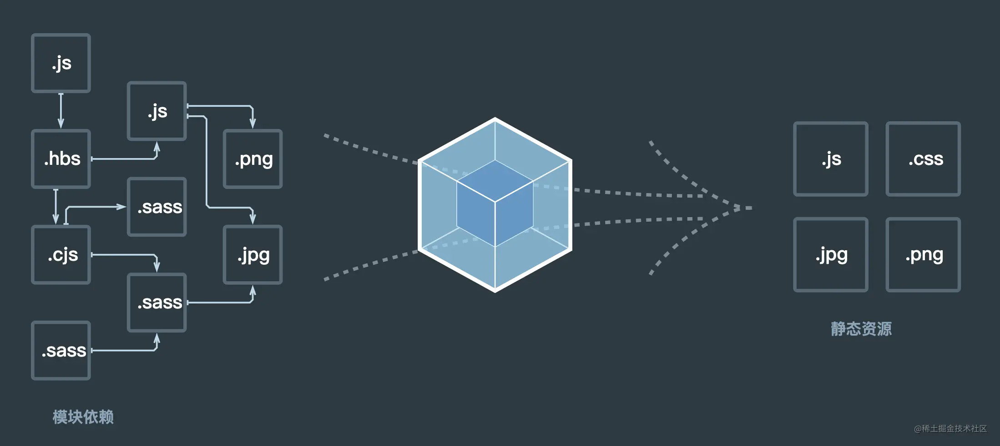

# 2023前端面试系列-- webpack & Git篇

https://juejin.cn/post/7196630860811075642

## 前言

本文是我的前端面试系列的工具篇，汇总整理了`webpack`和`Git`的常见面试题，后续的复习过程中随时会对本文查漏补缺。如有不当之处，欢迎指正，感谢。

其他章节内容可点击链接查看：

*   [2023前端面试系列--HTML & CSS 篇](https://juejin.cn/post/7175048315111735352 "https://juejin.cn/post/7175048315111735352")
*   [2023前端面试系列-- JS 篇](https://juejin.cn/post/7176644710847479869 "https://juejin.cn/post/7176644710847479869")
*   [2023前端面试系列-- Vue 篇](https://juejin.cn/post/7191325434486161467 "https://juejin.cn/post/7191325434486161467")
*   [2023前端面试系列--网络篇](https://juejin.cn/post/7192869386955259959 "https://juejin.cn/post/7192869386955259959")

## webpack

### 对webpack的理解？

`webpack` 是一个用于现代 JavaScript 应用程序的**静态模块打包工具**。我们可以使用`webpack`管理模块。因为在`webpack`看来，项目中的所有资源皆为模块，通过分析模块间的依赖关系，在其内部构建出一个依赖图，最终编绎输出模块为 HTML、JavaScript、CSS 以及各种静态文件（图片、字体等），让我们的开发过程更加高效。

 `webpack`的主要作用如下：

*   `模块打包`。可以将不同模块的文件打包整合在一起，并且保证它们之间的引用正确，执行有序。利用打包我们就可以在开发的时候根据我们自己的业务自由划分文件模块，保证项目结构的清晰和可读性。
*   `编译兼容`。在前端的“上古时期”，手写一堆浏览器兼容代码一直是令前端工程师头皮发麻的事情，而在今天这个问题被大大的弱化了，通过`webpack`的`Loader`机制，不仅仅可以帮助我们对代码做`polyfill`，还可以编译转换诸如`.less`，`.vue`，`.jsx`这类在浏览器无法识别的格式文件，让我们在开发的时候可以使用新特性和新语法做开发，提高开发效率。
*   `能力扩展`。通过`webpack`的`Plugin`机制，我们在实现`模块化打包`和`编译兼容`的基础上，可以进一步实现诸如按需加载，代码压缩等一系列功能，帮助我们进一步提高自动化程度，工程效率以及打包输出的质量。

### webpack的构建流程？

`webpack`的运行流程是一个串行的过程，从启动到结束会依次执行以下流程：

*   `初始化参数`：从配置文件和 Shell 语句中读取与合并参数，得出最终的参数
*   `开始编译`：用上一步得到的参数初始化 Compiler 对象，加载所有配置的插件，执行对象的 run 方法开始执行编译
*   `确定入口`：根据配置中的 entry 找出所有的入口文件
*   `编译模块`：从入口文件出发，调用所有配置的 loader 对模块进行翻译，再找出该模块依赖的模块，再递归本步骤直到所有入口依赖的文件都经过了本步骤的处理
*   `完成模块编译`：在经过上一步使用 loader 翻译完所有模块后，得到了每个模块被翻译后的最终内容以及它们之间的依赖关系
*   `输出资源`：根据入口和模块之间的依赖关系，组装成一个个包含多个模块的 Chunk，再把每个 Chunk 转换成一个单独的文件加入到输出列表，这步是可以修改输出内容的最后机会
*   `输出完成`：在确定好输出内容后，根据配置确定输出的路径和文件名，把文件内容写入到文件系统

在以上过程中，`webpack`会在特定的时间点广播出特定的事件，插件在监听到感兴趣的事件后会执行特定的逻辑，并且插件可以调用`webpack`提供的 API 改变`webpack`的运行结果。

**简单说：**

*   初始化：启动构建，读取与合并配置参数，加载 Plugin，实例化 Compiler
*   编译：从 entry 出发，针对每个 Module 串行调用对应的 loader 去翻译文件的内容，再找到该 Module 依赖的 Module，递归地进行编译处理
*   输出：将编译后的 Module 组合成 Chunk，将 Chunk 转换成文件，输出到文件系统中

### 常见的loader有哪些？

默认情况下，`webpack`只支持对`js`和`json`文件进行打包，但是像`css`、`html`、`png`等其他类型的文件，`webpack`则无能为力。因此，就需要配置相应的`loader`进行文件内容的解析转换。

常用的`loader`如下：

*   `image-loader`：加载并且压缩图片文件。
*   `less-loader`： 加载并编译 LESS 文件。
*   `sass-loader`：加载并编译 SASS/SCSS 文件。
*   `css-loader`：加载 CSS，支持模块化、压缩、文件导入等特性，使用`css-loader`必须要配合使用`style-loader`。
*   `style-loader`：用于将 CSS 编译完成的样式，挂载到页面的 style 标签上。需要注意 `loader` 执行顺序，`style-loader` 要放在第一位，`loader` 都是从后往前执行。
*   `babel-loader`：把 ES6 转换成 ES5
*   `postcss-loader`：扩展 CSS 语法，使用下一代 CSS，可以配合 `autoprefixer` 插件自动补齐 CSS3 前缀。
*   `eslint-loader`：通过 ESLint 检查 JavaScript 代码。
*   `vue-loader`：加载并编译 Vue 组件。
*   `file-loader`：把文件输出到一个文件夹中，在代码中通过相对 URL 去引用输出的文件 (处理图片和字体)
*   `url-loader`：与 `file-loader` 类似，区别是用户可以设置一个阈值，大于阈值会交给 `file-loader` 处理，小于阈值时返回文件 base64 形式编码 (处理图片和字体)

[更多loader，点击此处查看官方文档](https://www.webpackjs.com/loaders/)

### 常见的plugin有哪些？

`webpack`中的`plugin`赋予其各种灵活的功能，例如打包优化、资源管理、环境变量注入等，它们会运行在`webpack`的不同阶段（钩子 / 生命周期），贯穿了`webpack`整个编译周期。目的在于**解决 loader 无法实现的其他事**。

常用的`plugin`如下：

*   `HtmlWebpackPlugin`：简化 HTML 文件创建 (依赖于 html-loader)
*   `mini-css-extract-plugin`: 分离样式文件，CSS 提取为独立文件，支持按需加载 (替代extract-text-webpack-plugin)
*   `clean-webpack-plugin`: 目录清理

[更多plugin，点击此处查看官方文档](https://www.webpackjs.com/plugins/)

### loader和plugin的区别？

`loader`是文件加载器，能够加载资源文件，并对这些文件进行一些处理，诸如编译、压缩等，最终一起打包到指定的文件中；`plugin`赋予了`webpack`各种灵活的功能，例如打包优化、资源管理、环境变量注入等，目的是解决 `loader`无法实现的其他事。

在运行时机上，`loader` 运行在打包文件之前；`plugin`则是在整个编译周期都起作用。

在配置上，`loader`在`module.rules`中配置，作为模块的解析规则，类型为数组。每一项都是一个 Object，内部包含了 `test(类型文件)`、`loader`、`options (参数)`等属性；`plugin`在 `plugins`中单独配置，类型为数组，每一项是一个 `plugin` 的实例，参数都通过构造函数传入。

### webpack的热更新原理是？

`模块热替换(HMR - hot module replacement)`，又叫做`热更新`，在不需要刷新整个页面的同时更新模块，能够提升开发的效率和体验。热更新时只会局部刷新页面上发生了变化的模块，同时可以保留当前页面的状态，比如复选框的选中状态等。

热更新的核心就是客户端从服务端拉去更新后的文件，准确的说是 chunk diff (chunk 需要更新的部分)，实际上`webpack-dev-server`与浏览器之间维护了一个`websocket`，当本地资源发生变化时，`webpack-dev-server`会向浏览器推送更新，并带上构建时的`hash`，让客户端与上一次资源进行对比。客户端对比出差异后会向`webpack-dev-server`发起 Ajax 请求来获取更改内容(文件列表、hash)，这样客户端就可以再借助这些信息继续向`webpack-dev-server`发起 jsonp 请求获取该`chunk`的增量更新。

后续的部分(拿到增量更新之后如何处理？哪些状态该保留？哪些又需要更新？)由`HotModulePlugin` 来完成，提供了相关 API 以供开发者针对自身场景进行处理，像`react-hot-loader`和`vue-loader`都是借助这些 API 实现热更新。

### 如何提高webpack的构建速度？

1.  代码压缩
    *   JS压缩
        `webpack 4.0`默认在生产环境的时候是支持代码压缩的，即`mode=production`模式下。 实际上`webpack 4.0`默认是使用`terser-webpack-plugin`这个压缩插件，在此之前是使用 `uglifyjs-webpack-plugin`，两者的区别是后者对 ES6 的压缩不是很好，同时我们可以开启 `parallel`参数，使用多进程压缩，加快压缩。
    *   CSS压缩
        CSS 压缩通常是去除无用的空格等，因为很难去修改选择器、属性的名称、值等。可以使用另外一个插件：`css-minimizer-webpack-plugin`。
    *   HTML压缩
        使用`HtmlWebpackPlugin`插件来生成 HTML 的模板时候，通过配置属性`minify`进行 html 优化。

        ```js
            module.exports = {
                plugin:[
                    new HtmlwebpackPlugin({
                        minify:{
                            minifyCSS: false, // 是否压缩css
                            collapseWhitespace: false, // 是否折叠空格
                            removeComments: true // 是否移除注释
                        }
                    })
                ]
            }
        ```

2.  图片压缩
    配置`image-webpack-loader`
3.  Tree Shaking
    `Tree Shaking`是一个术语，在计算机中表示消除死代码，依赖于ES Module的静态语法分析（不执行任何的代码，可以明确知道模块的依赖关系）。 在`webpack`实现`Tree shaking`有两种方案：
    *   usedExports：通过标记某些函数是否被使用，之后通过 `Terser` 来进行优化的

        ```js
            module.exports = {
                ...
                optimization:{
                    usedExports
                }
            }
        ```
            
        使用之后，没被用上的代码在`webpack`打包中会加入`unused harmony export mul`注释，用来告知`Terser`在优化时，可以删除掉这段代码。

    *   sideEffects：跳过整个模块/文件，直接查看该文件是否有副作用-
        `sideEffects`用于告知`webpack compiler`哪些模块时有副作用，配置方法是在`package.json`中设置`sideEffects`属性。如果`sideEffects`设置为`false`，就是告知`webpack`可以安全的删除未用到的`exports`。如果有些文件需要保留，可以设置为数组的形式，如：
        ```js
            "sideEffecis":[
                "./src/util/format.js",
                "*.css" // 所有的css文件
            ]
        ```
4.  缩小打包域
    排除`webpack`不需要解析的模块，即在使用`loader`的时候，在尽量少的模块中去使用。可以借助 `include`和`exclude`这两个参数，规定`loader`只在那些模块应用和在哪些模块不应用。
5.  减少ES6转为ES5的冗余代码
使用bable-plugin-transform-runtime插件

6.  提取公共代码
通过配置CommonsChunkPlugin插件，将多个页面的公共代码抽离成单独的文件

更多优化构建速度方式，推荐阅读：[浅谈 webpack 性能优化（内附 webpack 学习笔记）](https://zhuanlan.zhihu.com/p/139498741)

## Git

### 常用命令

*   初始化一个仓库：git init
*   查看分支：git branch
*   将已修改或未跟踪的文件添加到暂存区：git add [file] 或 git add .
*   提交至本地仓库：git commit -m "提及记录xxxx"
*   本地分支推送至远程分支：git push
*   查看当前工作目录和暂存区的状态: git status
*   查看提交的日志记录： git log
*   从远程分支拉取代码：git pull
*   合并某分支(xxx)到当前分支： git merge xxx
*   切换到分支xxx：git checkout xxx
*   创建分支xxx并切换到该分支：git checkout -b xxx
*   删除分支xxx：git branch -d xxx
*   将当前分支到改动保存到堆栈中：git stash
*   恢复堆栈中缓存的改动内容：git stash pop

### git merge 和git rebase的区别？

相同点：

`git merge`和`git rebase`两个命令都⽤于从⼀个分⽀获取内容并合并到当前分⽀。

不同点：

1.  `git merge`会⾃动创建⼀个新的`commit`，如果合并时遇到冲突的话，只需要修改后重新`commit`。-
    

*   优点：能记录真实的`commit`情况，包括每个分⽀的详情-
    
*   缺点：由于每次`merge`会⾃动产⽣⼀个`commit`，因此在使用⼀些可视化的git工具时会看到这些自动产生的`commit`，这些`commit`对于程序员来说没有什么特别的意义，多了反而会影响阅读。

2.  `git rebase`会合并之前的`commit`历史。-
    

*   优点：可以得到更简洁的提交历史，去掉了merge 产生的`commit`-
    
*   缺点：因为合并而产生的代码问题，就不容易定位，因为会重写提交历史信息-
    

场景：

*   当需要保留详细的合并信息，建议使⽤`git merge`, 尤其是要合并到`master`上
*   当发现⾃⼰修改某个功能时提交比较频繁，并觉得过多的合并记录信息对自己来说没有必要，那么可尝试使用`git rebase`

### 对GitFlow的理解？

GitFlow重点解决的是由于源代码在开发过程中的各种冲突导致开发活动混乱的问题。重点是对各个分支的理解。

*   `master`：主分支。
*   `develop`：主开发分支，平行于`master`分支。
*   `feature`：功能分支，必须从`develop`分支建立，开发完成后合并到`develop`分支。
*   `release`：发布分支，发布的时候用，一般测试时候发现的 bug 在该分支进行修复。从`develop`分支建立，完成后合并回`develop`与`master`分支。
*   `hotfix`：紧急修复线上bug使用，必须从`master`分支建立，完成后合并回`develop`与`master`分支。

如果有合作开发经验，且开发过程规范的话，这部分问题不大，描述一下日常的开发流程即可。不了解的话，推荐阅读：[从零开始，学会Git和Gitflow工作流](https://juejin.cn/post/6844903517811900424)

## 后记

webpack 基础内容推荐阅读：[带你深度解锁Webpack系列(基础篇)](https://juejin.cn/post/6844904079219490830)

**参考链接：**

*   [「吐血整理」再来一打Webpack面试题](https://juejin.cn/post/6844904094281236487 "https://juejin.cn/post/6844904094281236487")
*   [浅谈 webpack 性能优化（内附 webpack 学习笔记）](https://link.juejin.cn/?target=https%3A%2F%2Fzhuanlan.zhihu.com%2Fp%2F139498741 "https://zhuanlan.zhihu.com/p/139498741")
