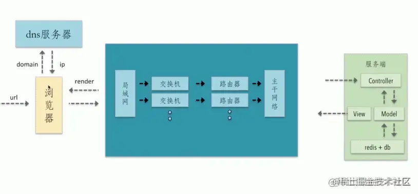
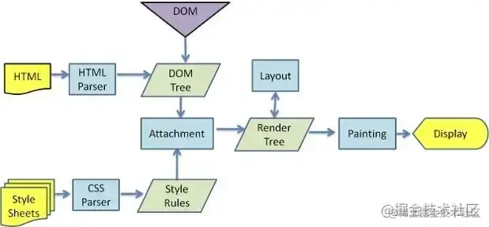

# tips

##### 1、JavaScript有几种数据类型？
8种，七种基本数据类型（Boolean、null、undefined、Number、BigInt、String、Symbol）以及对象（Object）   
[https://developer.mozilla.org/zh-CN/docs/Web/JavaScript/Guide/Grammar_and_Types#%E6%95%B0%E6%8D%AE%E7%BB%93%E6%9E%84%E5%92%8C%E7%B1%BB%E5%9E%8B](https://developer.mozilla.org/zh-CN/docs/Web/JavaScript/Guide/Grammar_and_Types#%E6%95%B0%E6%8D%AE%E7%BB%93%E6%9E%84%E5%92%8C%E7%B1%BB%E5%9E%8B)

##### 2、数组方法：apply()
##### 3、var声明的变量会挂在window对象上，let不会
##### 4、js变量类型取决于所依附的值
##### 5、怎么上线？
##### 6、typeof返回值

##### 7、instanceof
##### 8、Object是引用数据类型，且只存储于堆(heap)中说法正确吗？
说法是错误的，引用数据类型同时存放在堆与栈里面的，堆中存储对象，栈里面存储对象指向 指针，
顺便说一下深拷贝浅拷贝，基本数据类型 深拷贝 ，引用数据类型浅拷贝
深拷贝和浅拷贝的区别：浅拷贝主要是对指针的拷贝，拷贝后两个指针指向同一个内存空间，深拷贝不但对指针进行拷贝，并对指针指向的内容进行拷贝，经过深拷贝后的指针是指向两个不同地址的指针。
简单记忆方法：深拷贝cv当前所有文件，浅拷贝当前文件
————————————————
版权声明：本文为CSDN博主「快乐的想念17」的原创文章，遵循CC 4.0 BY-SA版权协议，转载请附上原文出处链接及本声明。
原文链接：https://blog.csdn.net/weixin_42178050/article/details/125851876

##### 9、null instanceof Object的值是什么？为什么？
是`false`

##### 10、`[] === []`为什么是false？
地址不同，`===`要求值和类型都相同，所以对于引用类型来说，只有地址相同才是值相同，左右地址不同，所以值也不同，为false

##### 11、一个函数的`call()`函数？

##### 12、从输入URL到页面加载的全过程


1. 首先在浏览器中输入URL
2. 查找缓存：浏览器先查看浏览器缓存-系统缓存-路由缓存中是否有该地址页面，如果有则显示页面内容。如果没有则进行下一步。

    - 浏览器缓存：浏览器会记录DNS一段时间，因此，只是第一个地方解析DNS请求；
    - 操作系统缓存:如果在浏览器缓存中不包含这个记录，则会使系统调用操作系统， 获取操作系统的记录(保存最近的DNS查询缓存)；
    - 路由器缓存：如果上述两个步骤均不能成功获取DNS记录，继续搜索路由器缓存；
    - ISP缓存：若上述均失败，继续向ISP搜索。

3. DNS域名解析：浏览器向DNS服务器发起请求，解析该URL中的域名对应的IP地址。DNS服务器是基于UDP的，因此会用到UDP协议。
4. 建立TCP连接：解析出IP地址后，根据IP地址和默认80端口，和服务器建立TCP连接
5. 发起HTTP请求：浏览器发起读取文件的HTTP请求，，该请求报文作为TCP三次握手的第三次数据发送给服务器
6. 服务器响应请求并返回结果：服务器对浏览器请求做出响应，并把对应的html文件发送给浏览器
7. 关闭TCP连接：通过四次挥手释放TCP连接
8. 浏览器渲染：客户端（浏览器）解析HTML内容并渲染出来，浏览器接收到数据包后的解析流程为：
    - 构建DOM树：词法分析然后解析成DOM树（dom tree），是由dom元素及属性节点组成，树的根是document对象
    - 构建CSS规则树：生成CSS规则树（CSS Rule Tree）
    - 构建render树：Web浏览器将DOM和CSSOM结合，并构建出渲染树（render tree）
    - 布局（Layout）：计算出每个节点在屏幕中的位置
    - 绘制（Painting）：即遍历render树，并使用UI后端层绘制每个节点。




9. JS引擎解析过程：调用JS引擎执行JS代码（JS的解释阶段，预处理阶段，执行阶段生成执行上下文，VO，作用域链、回收机制等等）

    - 创建window对象：window对象也叫全局执行环境，当页面产生时就被创建，所有的全局变量和函数都属于window的属性和方法，而DOM Tree也会映射在window的doucment对象上。当关闭网页或者关闭浏览器时，全局执行环境会被销毁。
    - 加载文件：完成js引擎分析它的语法与词法是否合法，如果合法进入预编译
    - 预编译：在预编译的过程中，浏览器会寻找全局变量声明，把它作为window的属性加入到window对象中，并给变量赋值为'undefined'；寻找全局函数声明，把它作为window的方法加入到window对象中，并将函数体赋值给他（匿名函数是不参与预编译的，因为它是变量）。而变量提升作为不合理的地方在ES6中已经解决了，函数提升还存在。
    - 解释执行：执行到变量就赋值，如果变量没有被定义，也就没有被预编译直接赋值，在ES5非严格模式下这个变量会成为window的一个属性，也就是成为全局变量。string、int这样的值就是直接把值放在变量的存储空间里，object对象就是把指针指向变量的存储空间。函数执行，就将函数的环境推入一个环境的栈中，执行完成后再弹出，控制权交还给之前的环境。JS作用域其实就是这样的执行流机制实现的。

##### 10、在软件开发过程中，我们可以采用不同的过程模型，下列有关增量模型描述正确的（）
A 已使用一种线性开发模型，具有不可回溯性
B 把待开发的软件系统模块化，将每个模块作为一个增量组件，从而分批次地分析、设计、编码和测试这些增量组件
C 适用于已有产品或产品原型（样品），只需客户化的工程项目
D 软件开发过程每迭代一次，软件开发又前进一个层次

a:瀑布模型
b.增量模型
c.原型模型
d.螺旋模型

##### 11、创建带有 ID 属性的 DOM 元素有什么副作用
A 会造成 DOM 树分支过多
B 会增加内存负担
C 会创建同名的全局变量
选AB、如果一个元素拥有ID属性,那么ID属性的属性值就会成为window对象的属性名，比如`id="app"`，通过`window.app`直接可以拿到dom，`window.app.id`的值也就是`app`（字符串类型）。

##### 12、问 123 的颜色是？
```html
<style>
    .main{
        color:blue
    }
    span{
        color:green
    }
</style>
<div style="color:red !important" class=""main"">
    <span>123</span>
</div>
```
A red
B blue
C green
D white
选C，继承的优先级最低，和`!important`没关系。

##### 13、