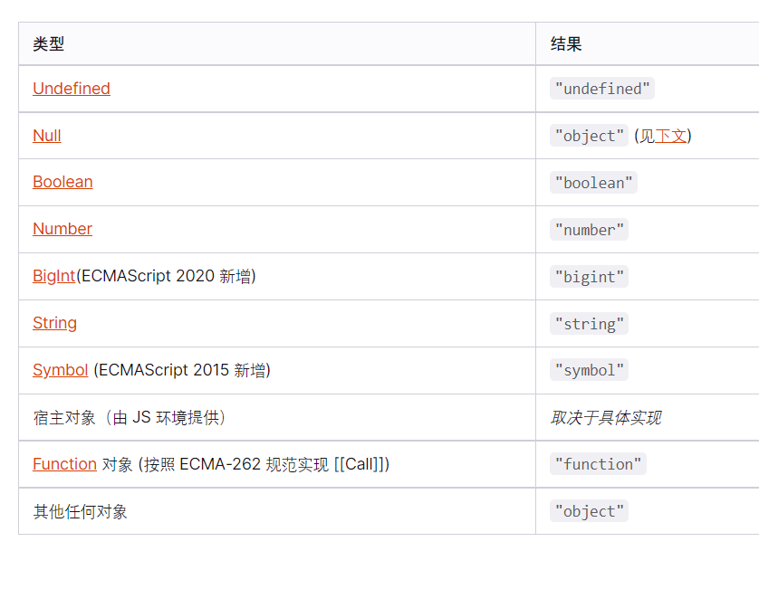

# tips

##### 1、JavaScript有几种数据类型？
8种，七种基本数据类型（Boolean、null、undefined、Number、BigInt、String、Symbol）以及对象（Object）   
[https://developer.mozilla.org/zh-CN/docs/Web/JavaScript/Guide/Grammar_and_Types#%E6%95%B0%E6%8D%AE%E7%BB%93%E6%9E%84%E5%92%8C%E7%B1%BB%E5%9E%8B](https://developer.mozilla.org/zh-CN/docs/Web/JavaScript/Guide/Grammar_and_Types#%E6%95%B0%E6%8D%AE%E7%BB%93%E6%9E%84%E5%92%8C%E7%B1%BB%E5%9E%8B)

##### 2、数组方法：apply()
##### 3、var声明的变量会挂在window对象上，let不会
##### 4、js变量类型取决于所依附的值
##### 5、怎么上线？
##### 6、typeof返回值

##### 7、instanceof
##### 8、Object是引用数据类型，且只存储于堆(heap)中说法正确吗？
说法是错误的，引用数据类型同时存放在堆与栈里面的，堆中存储对象，栈里面存储对象指向 指针，
顺便说一下深拷贝浅拷贝，基本数据类型 深拷贝 ，引用数据类型浅拷贝
深拷贝和浅拷贝的区别：浅拷贝主要是对指针的拷贝，拷贝后两个指针指向同一个内存空间，深拷贝不但对指针进行拷贝，并对指针指向的内容进行拷贝，经过深拷贝后的指针是指向两个不同地址的指针。
简单记忆方法：深拷贝cv当前所有文件，浅拷贝当前文件
————————————————
版权声明：本文为CSDN博主「快乐的想念17」的原创文章，遵循CC 4.0 BY-SA版权协议，转载请附上原文出处链接及本声明。
原文链接：https://blog.csdn.net/weixin_42178050/article/details/125851876

##### 9、null instanceof Object的值是什么？为什么？
是`false`

##### 10、`[] === []`为什么是false？
地址不同，`===`要求值和类型都相同，所以对于引用类型来说，只有地址相同才是值相同，左右地址不同，所以值也不同，为false

##### 一个函数的`call()`函数？